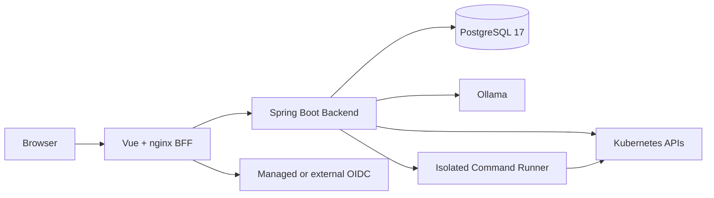

# KlueOps

> Evidence-guided Kubernetes Operations

[](https://github.com/JaeYounkim0w0/klueops/actions/workflows/release-candidate.yml)
[](https://github.com/JaeYounkim0w0/klueops/actions/workflows/supply-chain.yml)
[](LICENSE)

KlueOps는 Kubernetes 상태·이벤트·로그·구성 근거를 먼저 수집하고, 결정론적 진단과 AI 설명을 결합해 운영자가 안전하게 확인하고 조치하도록 돕는 오픈소스 운영 플랫폼입니다. 특정 고객의 상용 릴리스 인증이 아니라 누구나 검토하고 자신의 환경에서 재현·확장할 수 있는 프로젝트를 목표로 합니다.

## 주요 기능

- Kubernetes 클러스터·Namespace·워크로드·네트워크·스토리지 상태 탐색
- 근거, 수집 범위, confidence와 fallback을 포함한 Cluster/Namespace AI 분석
- Incident, Triage Queue, Runbook, 변경 timeline과 운영 증빙 관리
- RBAC, 범위 고정, preview/dry-run, 사후 검증과 audit을 적용한 kubectl 콘솔
- 39개 단일 점검 명령과 증상별 절차를 제공하는 Kubernetes Cook Book
- OIDC BFF, Tenant/Workspace/Cluster/Namespace 계층 권한과 credential 암호화
- 한국어·영어 UI, AI Chat, 분석 비교와 운영자 feedback

## 실행 구조



All-in-one Helm 설치는 Frontend, Backend, Managed Keycloak, Command Runner 네 Deployment를 구성합니다. PostgreSQL과 Ollama는 포함하지 않으며 접근 가능한 외부 endpoint가 필요합니다. 기존 설치 호환성을 위해 Helm release와 일부 내부 식별자에는 `aiops` 이름이 유지됩니다.

## 빠른 시작: 소스 검증

필수 도구는 Git, Java 17, Maven, Node.js 22, npm, Docker, kubectl, Helm 3, jq, curl과 OpenSSL입니다. Backend 테스트는 Docker를 사용해 PostgreSQL Testcontainers를 실행합니다.

```bash
git clone https://github.com/JaeYounkim0w0/klueops.git
cd klueops
npm ci --prefix frontend

./scripts/validate-open-source-hygiene.sh
./scripts/validate-docs.sh
./scripts/validate-backend.sh
./scripts/validate-frontend.sh
```

Docker Desktop Kubernetes용 전체 설치 계획은 실제 resource나 DB를 변경하지 않는 dry-run으로 먼저 확인할 수 있습니다.

```bash
kubectl config current-context
./scripts/init/all-in-one.sh --dry-run
```

2026-09-14에 공개 GitHub 저장소의 새 clone에서 Backend 248개 테스트, Frontend 91개 테스트·production build와 전체 Helm dry-run을 재현했습니다.

## 로컬 Kubernetes 설치

기본 로컬 프로필은 Docker Desktop Kubernetes, 외부 PostgreSQL 17과 Ollama를 전제로 합니다. 설치 전에 기본 비밀번호를 저장소나 values 파일에 기록하지 말고 Kubernetes Secret 또는 현재 shell session의 환경 변수로 제공해야 합니다.

1. [Initial Installation](docs/operations/initial-installation.md)의 사전 조건과 Secret 계약을 확인합니다.
2. `./scripts/init/all-in-one.sh --dry-run`으로 대상 context와 렌더링을 검증합니다.
3. 필요한 bootstrap 값을 현재 shell session에만 주입하고 `./scripts/init/all-in-one.sh`를 실행합니다.
4. `http://127.0.0.1:30081`과 runtime convergence 검증으로 네 Deployment가 Ready인지 확인합니다.

Managed Keycloak은 로컬·평가 편의를 위한 단일 replica 프로필입니다. 자체 운영 환경에서는 TLS, 조직 IdP, Secret manager, PostgreSQL 백업/복구와 HA 정책을 배포자가 결정해야 합니다.

## 저장소 구조

| 경로 | 내용 |
| --- | --- |
| `backend/` | Spring Boot API, AI 분석, Kubernetes adapter와 PostgreSQL persistence |
| `frontend/` | Vue 3, TypeScript, PrimeVue 기반 운영 UI |
| `command-runner/` | kubectl 명령을 격리 실행하는 별도 Spring Boot 서비스 |
| `keycloak/` | Managed Keycloak 최적화 이미지 |
| `deploy/helm/aiops/` | 로컬·자체 운영 설치용 Helm chart |
| `scripts/` | 설치, 검증, SBOM과 운영 자동화 |
| `docs/` | 제품 명세, 아키텍처, 개발·운영·보안 기준과 사용자 가이드 |

## 문서와 지원 범위

- [현재 제품 명세](docs/product/current-product-specification.md)
- [전체 문서 안내](docs/README.md)
- [아키텍처 개요](docs/architecture/overview.md)
- [사용자 가이드](docs/user-guide/README.md)
- [Kubernetes Cook Book 설계](docs/features/cluster-command-console/README.md)
- [보안 정책](SECURITY.md)
- [의존성·라이선스 정책](docs/security/dependency-policy.md)

Prometheus 장기 시계열, GitOps 애플리케이션 배포, 사용자 인프라의 HA/DR과 특정 환경의 운영 인증은 현재 핵심 범위가 아닙니다. AI 출력은 조언이며 Kubernetes 근거, RBAC, command safety와 audit이 최종 판단 기준입니다.

## 기여

Issue를 만들거나 pull request를 보내기 전에 [기여 가이드](CONTRIBUTING.md)와 [행동강령](CODE_OF_CONDUCT.md)을 확인해 주세요. 보안 취약점은 공개 Issue에 작성하지 말고 [보안 정책](SECURITY.md)의 비공개 절차를 사용합니다.

## License

Copyright 2026 Jae Youn Kim.

KlueOps is licensed under the [Apache License 2.0](LICENSE). 현재 별도 고지가 필요한 제3자 자료가 없어 `NOTICE` 파일은 두지 않으며, 해당 자료가 추가되면 함께 갱신합니다.
