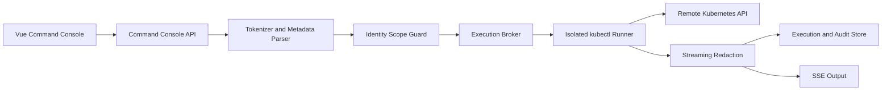
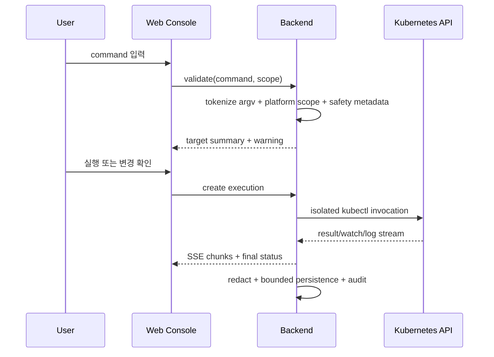

# Architecture Design

## 1. 결정

Backend application 프로세스에서는 `kubectl`을 실행하지 않는다. 별도의 격리된 Command Runner가 클러스터 버전에 맞는 실제 `kubectl` 바이너리를 shell 없이 argv 배열로 실행한다. 이 방식으로 표준 kubectl 호환성을 유지하면서 Backend 프로세스, 파일 시스템과 credential을 격리한다.



## 2. Hexagonal 경계

### Inbound adapters

- `ClusterCommandController`: validate, execute, history, cancel, stream
- `CommandFavoriteController`: 개인/tenant 공용 즐겨찾기
- OpenAPI annotation과 ProblemDetail 오류 계약

### Application services

- `ClusterCommandApplicationService`: 전체 use case 조율
- `CommandValidationService`: argv tokenization, target/safety metadata, scope 검증
- `CommandExecutionService`: 실행, timeout, cancel, 저장, audit
- `CommandSessionService`: exec/attach/port-forward/file transfer 세션 수명주기
- `CommandFavoriteService`: 템플릿 유효성, 소유권, 정렬
- `CommandOutputRedactor`: Secret/token/credential 마스킹과 크기 제한

### Domain

- `KubectlInvocation`
- `CommandTarget`
- `CommandSafety`
- `CommandCapability`
- `CommandExecution`
- `CommandFavorite`
- `CommandParameterDefinition`

### Outbound ports

- `KubectlRunnerPort`
- `InteractiveSessionPort`
- `FileTransferPort`
- `PortForwardPort`
- `CommandExecutionRepository`
- `CommandFavoriteRepository`
- `CommandStreamPublisher`
- `AuditPort`
- 기존 `ClusterCredentialPort`

### Outbound adapters

- `IsolatedKubectlRunnerAdapter`
- `WebSocketInteractiveSessionAdapter`
- 기존 Fabric8 adapter는 리소스 자동완성, 화면용 조회, 실행 전 대상 요약에만 사용
- JPA repositories
- Spring SSE publisher
- 기존 envelope encryption credential adapter

## 3. 기존 코드 재사용과 분리

현재 `AnalysisCommandPolicy`는 AI가 제안한 자동 조치의 안전 경계로 유지한다. 사용자가 직접 사용하는 Kubernetes Console은 전체 kubectl을 제공하므로 동일 allow-list를 적용하지 않는다. 양쪽은 실행 기록, 출력 마스킹, scope guard와 audit만 공유한다.

```text
AnalysisCommandPolicy ── AI 자동 조치 allow-list
Kubernetes Console   ── 사용자 직접 kubectl, 위험도 분류와 확인
Shared Execution     ── scope, runner, redaction, audit, session lifecycle
```

기존 API를 바로 제거하지 않는다. AI Analysis API는 `AnalysisCommandPolicy`와 공통 execution service를 호출하고 기존 응답 계약을 유지한다. 회귀 테스트 통과 뒤 persistence를 공통 `command_executions` 모델로 이동한다.

## 4. 명령 처리 단계



### 상세 순서

1. 입력 길이, null byte와 newline 정책을 먼저 검사한다.
2. tokenizer가 quote와 escape를 kubectl argv로 변환하되 shell expansion, pipe, redirect, chaining은 해석하지 않는다.
3. parser는 실행 제한용 allow-list가 아니라 대상 표시, 위험도, 확인 화면과 감사 metadata를 생성한다. 해석하지 못한 표준 kubectl option도 원문 argv로 실행할 수 있다.
4. 현재 상세 Cluster ID는 UI 입력이 아니라 URL path에서 고정한다.
5. 사용자 tenant/cluster/namespace scope를 확인한다.
6. 플랫폼 command capability와 등록 credential 상태를 확인한다. Kubernetes 세부 권한은 실제 kubectl/API 응답으로 최종 판정한다.
7. 변경/삭제 명령은 가능한 경우 `--dry-run=server`, `kubectl diff` 또는 대상 snapshot을 사용해 영향 정보를 만든다. dry-run을 지원하지 않아도 권한 있는 사용자는 경고 확인 후 실행할 수 있다.
8. 실행 ID를 먼저 발급하고 원격 API를 호출한다.
9. 출력은 chunk 단위로 마스킹하고 최대 크기를 적용한다.
10. 종료 상태, duration, row/byte count, truncation, request ID를 저장한다.

## 5. Command Runner

- Backend와 별도 Deployment/프로세스로 운영하고 외부에서 직접 접근할 Service를 노출하지 않는다.
- non-root, read-only root filesystem, seccomp, capability drop, resource limit과 실행별 임시 directory를 적용한다.
- 실행 가능한 binary는 서명/검증된 `kubectl`로 고정하고 `execve` 계열 argv 호출만 사용한다. `/bin/sh -c`는 사용하지 않는다.
- kubeconfig는 메모리 또는 실행별 tmpfs에 생성하고 종료 즉시 폐기한다. stdout, process argument와 audit에 credential을 남기지 않는다.
- 클러스터 버전과 kubectl version skew를 확인해 지원 binary를 선택한다. 지원 범위를 벗어나면 실행 전 명확히 안내한다.
- 실행별 CPU, memory, process, output, idle timeout과 전체 timeout을 적용한다.
- Runner가 중단되면 lease 만료를 통해 실행과 임시 credential을 정리한다.

## 6. Streaming And Interactive Sessions

- 일반 조회는 JSON 응답 또는 SSE를 사용한다.
- `logs -f`, `get --watch`는 SSE를 사용한다.
- `exec -it`, `attach`는 terminal resize와 양방향 입출력이 필요한 인증된 WebSocket을 사용한다.
- terminal session은 브라우저 재접속을 짧은 grace period 동안 허용하되 기본적으로 공유하지 않는다.
- `cp`는 별도 multipart/download endpoint와 진행 event를 사용하고 크기 제한, 경로 정규화와 악성 파일 검사를 적용한다.
- `port-forward`는 Runner 내부 loopback에만 bind하고, 플랫폼 gateway가 사용자/tenant/session을 매 요청 검증하는 임시 URL로 중계한다. URL에는 credential을 넣지 않으며 TTL과 idle timeout을 적용한다.
- event type은 `started`, `stdout`, `stderr`, `heartbeat`, `completed`, `failed`, `canceled`다.
- reconnect용 `Last-Event-ID`를 지원하되 서버 메모리에는 최근 bounded chunk만 유지한다.
- 한 사용자당 streaming 3개, 한 cluster당 20개를 기본 상한으로 둔다.
- 기본 15분 후 종료하며 운영 설정으로 1~60분 범위에서 조절한다.
- 브라우저 연결이 끊기면 grace period 뒤 원격 stream을 종료한다.

## 7. 원격 클러스터 연결

Runner가 Backend로부터 짧은 수명의 credential material을 전달받으므로 브라우저는 kubeconfig나 원격 API URL을 받지 않는다.

- direct network reachability가 있어야 한다.
- kubeconfig server 주소와 TLS 설정을 그대로 사용한다.
- ServiceAccount credential은 최소 권한으로 구성한다.
- 연결 불가, TLS, token 만료, Kubernetes 401/403, timeout을 서로 다른 오류 코드로 반환한다.
- jump server가 필요한 환경은 추후 outbound agent/connector ADR에서 다룬다.

## 8. 성능과 안정성

- 동시 실행은 bounded executor와 cluster별 semaphore로 제한한다.
- 기본 command timeout 60초를 적용하되 `wait`, `drain`, `rollout status` 등 장기 명령은 명령별 timeout을 사용한다. interactive/stream 세션은 기본 15분이며 활동 중 연장할 수 있다.
- output은 기본 1MB, 최대 5MB에서 절단하고 `truncated=true`를 표시한다.
- 대량 list는 API pagination 또는 limit를 적용한다.
- 동일 사용자의 동일 read-only 명령 중복 실행은 짧은 시간 내 공유할 수 있으나 live 여부를 UI에 표시한다.
- 실행 결과는 cache하지 않는다. 자동완성용 리소스 이름만 짧게 cache하고 live/snapshot 여부를 표시한다.
- kubectl process 수, interactive session과 port-forward는 사용자/tenant/cluster별 semaphore로 제한한다.

## 9. 실패 모델

| 오류 | 사용자 표현 | 재시도 |
| --- | --- | --- |
| Tokenize failure | 닫히지 않은 quote 등 argv 변환 오류 위치 | 입력 수정 후 가능 |
| Platform scope denied | 현재 계정의 허용 범위 표시 | 권한 변경 전 불가 |
| Kubernetes RBAC denied | 필요한 verb/resource 표시 | Cluster RBAC 변경 후 가능 |
| Credential failure | Credential Health 이동 제공 | credential 갱신 후 가능 |
| Remote timeout | 경과 시간과 API endpoint 상태 | 가능 |
| Output truncated | 표시/저장 상한과 실제 byte 수 | 더 좁은 selector 권고 |
| Stream disconnected | 재연결 또는 새 실행 선택 | read-only만 자동 재연결 |
| Runner unavailable | Runner 상태와 재시도 경로 | 가능 |
| kubectl version skew | Cluster 버전과 선택된 client 버전 | 호환 Runner 준비 후 가능 |
| Interactive idle timeout | 종료 사유와 새 세션 시작 | 가능 |
