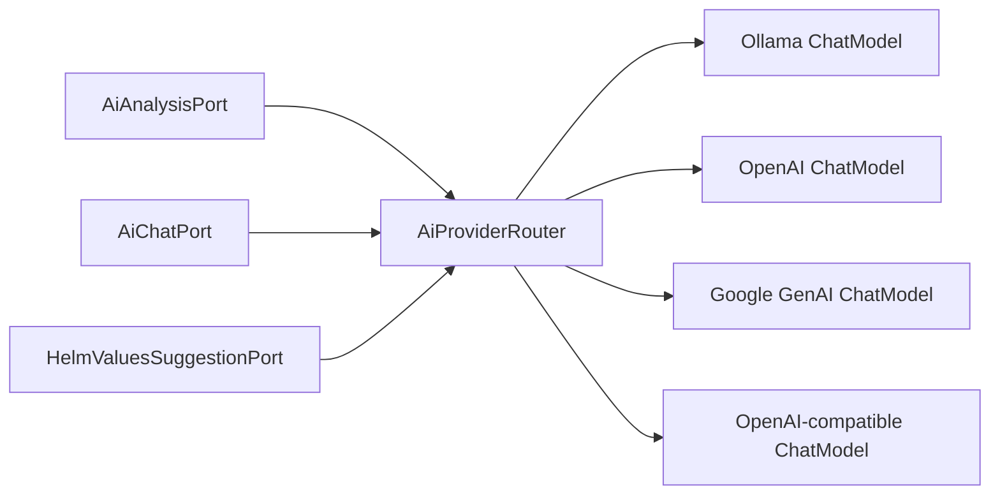

# Phase 2 AI Provider and Model Strategy

기준일: 2026-09-15

상태: 설계 완료, 구현 미착수

## 1. 현재 기준과 문제

현재 기본값은 Ollama `qwen2.5-coder:7b`이며 하나의 startup configuration과 Ollama-specific adapter가 AI Analysis와 AI Chat을 제공한다.

이 모델은 코드 생성에 초점을 둔 7B 모델이라 다음 세 작업의 공통 기본값으로는 최적화가 부족하다.

- 한국어 Kubernetes RCA와 운영 설명
- 근거 기반 structured JSON 합성
- Helm values schema 이해와 자연어 → bounded patch 변환

2차에서는 Provider 교체 가능성과 workload별 model 선택을 먼저 설계하고, model 변경은 regression 결과로 결정한다.

## 2. 로컬 모델 선정 원칙

Qwen을 계속 사용한다는 전제를 두지 않는다. `qwen2.5-coder:7b`는 기존 결과를 비교하기 위한 baseline일 뿐이며, 새 기본 모델은 동일한 KlueOps fixture로 모델군을 교차 평가한 뒤 결정한다.

제품 배포 조건은 **9B 이하**로 고정한다. Apple Silicon 24GB급 개발 환경뿐 아니라 일반적인 운영 노드에서 Kubernetes 구성 요소와 Ollama가 메모리를 공유하는 상황을 고려한 제한이다. 9B를 초과한 모델은 성능 비교 참고 자료일 수는 있으나 KlueOps의 내장 local profile 후보나 자동 설치 대상에는 포함하지 않는다.

### 1차 평가 shortlist

| 후보 | Ollama 배포 크기 / context | 강점 | 우려 | 분류 |
| --- | --- | --- | --- | --- |
| `qwen3.5:9b` | 약 6.6GB / 256K | 다국어, tool/thinking, 9B 상한 내 최신 범용 후보 | Kubernetes 근거 정합성과 thinking latency 실측 필요 | **Balanced 우선 후보** |
| `granite3.3:8b` | 약 4.9GB / 128K | 한국어 명시 지원, RAG·instruction·function calling, Apache 2.0 | 복합 RCA 품질과 JSON 준수율 실측 필요 | **Balanced 우선 후보** |
| `qwen3:8b` | 약 5.2GB / 40K | reasoning과 tool use, 8B 범위의 최신 Qwen 비교군 | thinking 제어 시 latency, 근거 정합성 실측 필요 | Balanced 우선 후보 |
| `llama3.1:8b` | 약 4.9GB / 128K | 범용 reasoning·tool use, 큰 생태계 | 한국어 운영 용어 품질과 Meta 라이선스 별도 검토 | Balanced 비교 후보 |
| `command-r7b:7b` | 약 5.1GB / 8K | 한국어 포함 23개 언어, RAG·tool use | context가 짧아 큰 진단 bundle에 불리 | RAG 비교 후보 |
| `gemma3:4b` | 약 3.3GB / 128K | 140개 이상 언어, 작은 메모리, 일반 reasoning | 4B의 복합 RCA와 schema 준수 한계 가능 | Compact 후보 |
| `phi4-mini:3.8b` | 약 2.5GB / 128K | 제약 환경, reasoning·function calling | 한국어 Kubernetes 설명 품질 실측 필요 | Compact 비교 후보 |
| `mistral:7b` | 약 4.4GB / 32K | tool use와 작은 배포 크기 | 비교적 오래된 세대, 한국어 품질 우려 | 보조 비교 후보 |
| `qwen2.5-coder:7b` | 현재 설치 | 기존 동작과 회귀 기준 | coder 중심이며 설명·RCA 공통 모델로 제한 | Baseline |

공식 모델 정보:

- Gemma 3: <https://ollama.com/library/gemma3>
- Qwen 3.5: <https://ollama.com/library/qwen3.5>
- Qwen 3: <https://ollama.com/library/qwen3>
- IBM Granite 3.3: <https://ollama.com/library/granite3.3>
- Llama 3.1: <https://ollama.com/library/llama3.1>
- Command R7B: <https://ollama.com/library/command-r7b>
- Phi-4 Mini: <https://ollama.com/library/phi4-mini>
- Mistral 7B: <https://ollama.com/library/mistral>

`gemma3:12b`, `gpt-oss:20b`, Mistral Small 24B와 Llama 4는 파라미터 상한을 넘으므로 shortlist에서 제외한다. 특정 계열에 종속되지 않도록 UI와 DB는 Ollama model tag를 문자열로 관리한다.

### 잠정 권장안

- 첫 비교 대상: `qwen3.5:9b`, `granite3.3:8b`, `qwen3:8b`, `llama3.1:8b`
- 기본 모델: 아직 변경하지 않고 `qwen2.5-coder:7b` 유지
- 승격 방식: 아래 gate에서 종합 점수가 가장 높은 모델을 `Balanced` 기본값으로 지정
- 모델별 라우팅: 한 모델이 모든 항목을 이기지 못하면 `ANALYSIS`, `CHAT`, `HELM_VALUES` 목적별로 다른 local model을 허용

따라서 `qwen3.5:9b`를 최신 범용 품질 후보, `granite3.3:8b`를 한국어·라이선스·RAG 적합성 후보, `qwen3:8b`를 자원 효율 reasoning 후보, `llama3.1:8b`를 생태계 비교 후보로 둔다. Compact 설치는 `gemma3:4b`와 `phi4-mini:3.8b`를 비교한다. 현재 자료만으로 특정 모델을 최종 승자로 확정하지 않는다.

Ollama structured outputs는 JSON schema를 이용할 수 있으므로 기존 단순 `format=json`보다 `analysis-result.v1`과 `helm-values-suggestion.v1`의 축소 schema를 provider adapter에 전달한다. 공식 문서: <https://docs.ollama.com/capabilities/structured-outputs>

## 3. 기본 모델 변경 gate

설계 문서만으로 default를 바꾸지 않는다. 같은 sanitized fixture와 prompt version으로 최소 다음을 비교한다.

| 기준 | 최소 조건 |
| --- | --- |
| `analysis-result.v1` schema valid | 기존 baseline 이상 |
| Evidence alignment | 기존 baseline 이상, 무근거 결론 증가 없음 |
| Hallucination/abstention | 위험 제안 증가 없음 |
| 한국어 운영 설명 | 용어 보존과 beginner explanation 통과 |
| Helm Values patch schema valid | 95% 이상 |
| Unknown Values key | 0건 또는 deterministic rejection |
| Secret echo | 0건 |
| Section timeout/fallback | 기존 bounded 기준 유지 |
| 메모리/latency | 명시한 local profile budget 내 |

후보 중 하나가 gate를 통과하면 새 설치의 기본값으로 승격하고 기존 사용자는 values/env override로 `qwen2.5-coder:7b`를 계속 사용할 수 있게 한다. 결과는 model, quantization, prompt version, fixture version과 hardware profile로 기록한다.

## 4. 지원 Provider

| Provider type | 목적 | 인증 |
| --- | --- | --- |
| `OLLAMA` | 기본 local/private inference | 내부 URL, 인증 optional |
| `OPENAI` | 관리형 품질·확장 선택 | API key 또는 existing Secret |
| `GOOGLE_GENAI` | Gemini 관리형 선택 | API key 또는 existing Secret |
| `OPENAI_COMPATIBLE` | vLLM 등 자체 endpoint | base URL + optional API key |

Spring AI는 Ollama, OpenAI와 Google GenAI를 포함한 provider-neutral ChatModel 계층, streaming, JSON과 observability 기능을 제공한다. 단, 현재 Ollama-specific option을 application service에 노출하지 않고 KlueOps port에서 공통 capability로 정규화해야 한다.

- <https://docs.spring.io/spring-ai/reference/api/chat/comparison.html>
- <https://docs.spring.io/spring-ai/reference/api/chat/openai-chat.html>

## 5. Provider profile과 Tenant 정책

Provider credential과 Tenant 선택을 분리한다.

```text
Platform Manager
└─ Provider Profile 등록
   ├─ Local Ollama
   ├─ OpenAI Production
   └─ Google GenAI Production

Tenant Admin
└─ 허용된 Profile 중 workload별 선택
   ├─ AI Analysis: Local Ollama
   ├─ AI Chat: OpenAI Production
   └─ Helm Values: Local Ollama
```

### AiProviderProfile

```text
id, name, providerType
baseUrl, credentialRef
defaultModel, allowedModels
enabled, externalDataTransfer
connectTimeout, responseTimeout, maxRetries
createdBy, updatedAt, lastValidatedAt, validationStatus
```

### TenantAiRoutingPolicy

```text
tenantId
purpose: ANALYSIS | CHAT | HELM_VALUES
primaryProfileId, model
fallbackProfileId, fallbackModel
externalTransferAllowed
maximumContextChars, maximumOutputTokens
```

Platform profile은 credential을 소유하고 Tenant는 허용된 profile/model만 선택한다. Tenant가 자체 key를 사용하는 BYOK profile은 해당 Tenant에만 노출한다.

## 6. Provider Router

현재 단일 `ChatClient.Builder` injection을 다음 구조로 바꾼다.



```java
interface AiProviderRouter {
    ProviderCompletion complete(AiWorkloadRequest request);
    void stream(AiWorkloadRequest request, Consumer<String> delta);
}
```

application service는 provider/model SDK type을 알지 않는다. Adapter는 응답을 공통 metadata로 정규화한다.

```text
profileId, providerType, model
latencyMs, firstTokenLatencyMs
inputTokens, outputTokens
finishReason, structuredOutputValid
fallbackUsed, maskedErrorCode
```

## 7. 외부 모델 예시와 선택

Model 이름은 빠르게 바뀌므로 설정 화면에서 Provider model list/validation으로 확인하고 DB에는 사용자가 선택한 정확한 ID를 저장한다. `latest` alias보다 stable/versioned ID를 권장한다.

- OpenAI: balanced 운영 profile의 초기 평가 후보는 `gpt-5.6-terra`, 복잡한 RCA 평가 후보는 `gpt-5.6-sol`, 비용·latency 우선 후보는 `gpt-5.6-luna`로 둔다. 공식 model catalog를 기준으로 배포 시 재확인한다: <https://platform.openai.com/docs/models>
- Google GenAI: stable Flash 계열을 기본 평가 후보로 삼고 Pro 계열은 고난도 회귀 비교에만 사용한다. model list API로 지원 기능과 token limit을 검증한다: <https://ai.google.dev/api/models>
- Gemini structured output은 JSON Schema subset을 지원하므로 KlueOps public schema를 provider별 지원 subset으로 투영하고 결과를 다시 전체 schema로 검증한다: <https://ai.google.dev/gemini-api/docs/structured-output>

모델 이름을 소스 enum으로 고정하지 않는다. Provider type과 capability만 코드에 두고 실제 model ID는 profile 데이터로 관리한다.

## 8. 외부 전송 보안

Kubernetes evidence를 외부 Provider에 보내는 것은 단순 runtime 설정이 아니라 Tenant 데이터 반출 결정이다.

- `externalTransferAllowed=false`가 기본이다.
- Local primary 실패 시 외부 Provider로 자동 fallback하지 않는다.
- Tenant Admin이 purpose별 외부 전송과 fallback을 명시적으로 켜야 한다.
- 요청 직전에 destination Provider/model, 전송 category와 masked context size를 Audit에 기록한다.
- Secret, token, certificate, kubeconfig, ConfigMap value와 raw manifest는 전송하지 않는다.
- Pod log는 기존 masking과 line/item budget 후 필요한 evidence만 보낸다.
- Chart README, values comments와 templates는 prompt injection 가능성이 있는 untrusted data로 표시한다.
- API key는 AES-256-GCM 또는 Kubernetes existing Secret으로 저장하고 조회 API는 마지막 4자리도 기본 노출하지 않는다.
- Provider error body에 prompt/credential이 포함될 수 있으므로 원문을 log/audit에 저장하지 않는다.

## 9. Fallback 규칙

```text
Provider timeout/invalid JSON
  ├─ ANALYSIS: 해당 section만 deterministic Kubernetes fallback
  ├─ CHAT: 부분 응답 표시 후 명시적 재시도
  └─ HELM_VALUES: AI 제안 실패, Form/YAML 편집 유지
```

Fallback은 profile에 설정해도 다음을 만족해야 한다.

- 같은 Tenant와 purpose에 허용된 profile
- 외부 전송 정책 동일 또는 더 제한적
- 한 요청당 최대 1회 fallback
- 전체 timeout budget을 넘지 않음
- UI에 primary/fallback provider와 실패 이유 표시

## 10. Provider 설정 UX

Platform Manager 화면은 다음 순서를 사용한다.

1. Provider type과 profile 이름 선택
2. Base URL과 existing Secret/API key 입력
3. 연결 검사
4. model 조회/직접 입력 및 capability 검사
5. context/output/timeout budget 설정
6. 외부 전송 경고 확인
7. Tenant 허용 범위 지정
8. 저장

Tenant Admin은 key를 보지 않고 purpose별 profile/model, 외부 전송과 fallback만 선택한다. 변경은 새 요청부터 적용하며 실행 중인 분석 job의 provider/model은 바꾸지 않는다.

### 10.1 Ollama Local Model 관리

Ollama Provider Profile에는 `Models 관리` 진입점을 제공한다. 현재 `qwen2.5-coder:7b`를 유지한 채 여러 model tag를 설치할 수 있으며 Router가 요청 purpose의 정확한 model tag를 Ollama 요청에 지정한다.

```text
Platform Manager
→ AI Providers
→ Default Ollama
→ Models 관리
→ 후보 또는 model tag 선택
→ 크기/parameter/license 확인
→ Download Job
→ Capability/회귀 평가
→ Tenant 사용 허용
```

Ollama API adapter는 다음 endpoint만 allowlist한다.

| Endpoint | 용도 |
| --- | --- |
| `GET /api/tags` | 설치된 model, digest, size, parameter와 quantization 조회 |
| `POST /api/show` | license, capability와 context metadata 검증 |
| `POST /api/pull` | 승인된 model tag 다운로드와 progress streaming |
| `DELETE /api/delete` | 미사용 model 삭제 |
| `GET /api/ps` | 현재 loaded model과 memory 상태 조회 |

공식 API: <https://docs.ollama.com/api/tags>, <https://docs.ollama.com/api/pull>, <https://docs.ollama.com/api-reference/show-model-details>, <https://docs.ollama.com/api/ps>

- `parameter_size` 파싱 결과가 9B를 초과하거나 불명확하면 활성화하지 않는다.
- 임의 URL/파일/Modelfile 입력은 MVP에서 허용하지 않고 Ollama library model tag만 받는다.
- 다운로드 전 예상 크기, 남은 volume, license와 source를 보여준다.
- model pull/delete는 Platform Manager 전용 async Job이며 중복 요청과 동시 download를 제한한다.
- 현재 routing, fallback 또는 실행 중 Job이 참조하는 model은 삭제하지 않는다.
- `DOWNLOADING → INSTALLED → VALIDATING → CANDIDATE → APPROVED | REJECTED` 상태를 기록한다.
- Candidate는 회귀 fixture 실행에만 사용할 수 있고 Tenant production routing에는 Approved model만 노출한다.
- 여러 model을 디스크에 보관할 수 있지만 loaded model 수, keep-alive와 요청 queue는 Provider profile resource budget으로 제한한다.

Model download/validation Job도 배포 작업과 같은 전역 Job Center에 나타나지만 Application History에는 포함하지 않는다. Job Center는 실행 유형과 대상 link로 `MODEL_DOWNLOAD`, `CHART_IMPORT`, `HELM_OPERATION`을 구분한다.

### 10.2 목적별 Local routing

Tenant Admin은 Platform이 허용한 Installed/Approved model 중에서 목적별로 선택한다.

```text
ANALYSIS    → Default Ollama / granite3.3:8b
CHAT        → Default Ollama / qwen3.5:9b
HELM_VALUES → Default Ollama / qwen3:8b
```

동일 Provider 안의 model 변경도 routing policy revision과 Audit을 남긴다. 첫 요청의 model load 지연, 평균 latency, schema validity와 최근 회귀 결과를 selector에 표시한다. 설치되어 있지 않거나 9B를 초과하거나 Approved가 아닌 model은 저장을 차단한다.

## 11. 비용과 관측성

외부 Provider는 usage metadata가 있을 때 다음을 기록한다.

- Tenant/purpose/provider/model
- input/output token 수
- latency와 success/fallback
- estimated cost는 가격 snapshot version이 있을 때만 `ESTIMATED`로 표시

Prompt와 response 원문은 observability metadata에 저장하지 않는다. Model 비교는 같은 fixture/prompt version으로 수행하며 AI Trust Center에 sample count, schema validity, evidence alignment, latency와 fallback을 함께 표시한다.

## 12. migration과 호환성

- 기존 `AIOPS_AI_BASE_URL`, `AIOPS_AI_MODEL`은 자동 생성되는 system-managed `Default Ollama` profile로 이관한다.
- Provider profile이 없거나 DB 연결 전에는 기존 env configuration으로 bootstrap한다.
- 기존 분석 결과와 대화의 model field는 유지하고 provider/profile metadata를 nullable로 추가한다.
- `OllamaAiException` 같은 이름은 provider-neutral `AiProviderException`과 error code로 교체한다.
- Ollama만 사용하는 설치에는 외부 Provider dependency와 credential이 필수가 아니다.

## 13. 검증

- Provider별 fake ChatModel contract test
- connection test가 실제 Kubernetes/Chart data를 전송하지 않는지 검증
- profile CRUD, key masking과 Tenant A/B isolation
- local-only Tenant의 external fallback 차단
- section timeout/invalid JSON과 deterministic fallback
- structured output schema projection/normalization
- Helm Values unknown key, type mismatch, Secret echo와 prompt injection fixture
- 같은 corpus의 baseline 대 Gemma/Qwen/Granite/Llama shortlist regression
- OpenAI/Gemini integration test는 명시적 Secret이 있을 때만 opt-in 실행
