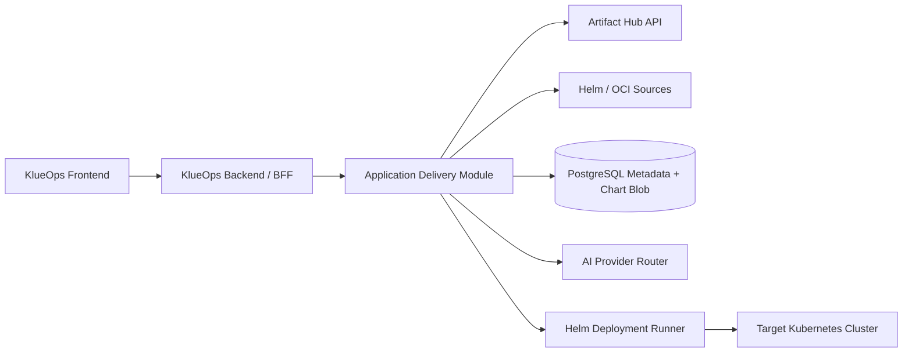
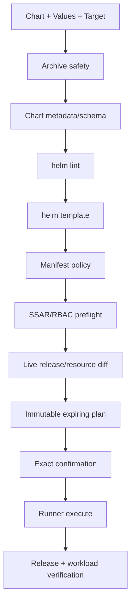

# Phase 2 Application Delivery Architecture

기준일: 2026-09-14  
상태: 설계 완료, 구현 미착수

## 1. 결정

- 같은 KlueOps 저장소, 제품, Frontend와 Backend를 유지한다.
- Application Delivery는 Backend의 독립 bounded context로 구현한다.
- Helm CLI, Chart unpack/render와 Cluster mutation은 선택형 `Helm Deployment Runner`로 물리적으로 격리한다.
- 원본 Chart는 immutable artifact로 저장하고 Custom은 Values Profile만 지원한다.
- Application 기능은 feature flag로 끌 수 있고 비활성화 시 Runner도 설치하지 않는다.
- API와 port가 안정되고 독립 확장 요구가 생길 때만 Application Backend 서비스 추출을 검토한다.

## 2. 논리 구조



Frontend는 하나를 유지한다. Browser가 Artifact Hub, Chart repository, AI Provider 또는 Runner에 직접 접근하지 않는다.

## 3. Backend package 경계

```text
io.strato.aiops.applicationdelivery
├─ domain
│  ├─ chart
│  ├─ values
│  ├─ deployment
│  └─ release
├─ application
│  ├─ port.in
│  ├─ port.out
│  └─ service
└─ adapter
   ├─ in.web
   ├─ out.artifacthub
   ├─ out.chartsources
   ├─ out.persistence
   ├─ out.ai
   └─ out.runner
```

기존 `AnalysisApplicationService`나 Cluster adapter 구현을 직접 호출하지 않는다. Tenant/Cluster/credential, audit, async job과 AI는 공개 application port를 사용한다.

ArchUnit gate:

- 기존 domain/application은 `applicationdelivery.adapter`를 참조하지 않는다.
- Application Delivery domain은 Spring, JPA, HTTP, Helm과 AI SDK를 참조하지 않는다.
- Helm argv 생성, temporary file과 process 실행은 Runner 밖에 존재하지 않는다.
- Provider-specific DTO는 application port를 통과하지 않는다.

## 4. Component 책임

### 4.1 Application Delivery Module

- Tenant/Workspace/Cluster 권한 평가
- Catalog search와 source metadata normalization
- Chart artifact/version과 Values Profile 관리
- AI Values suggestion orchestration
- preview 요청과 정책 결과 조립
- exact confirmation과 async job lifecycle
- Release metadata, history, audit와 사후 검증

### 4.2 Helm Deployment Runner

- Chart archive 안전 검사와 bounded unpack
- `helm lint`, `helm template`, install/upgrade/status/history/rollback/uninstall
- argv allowlist, namespace/release 고정과 timeout/cancel
- 임시 kubeconfig, registry config, Chart와 Values의 job 종료 cleanup
- NDJSON progress와 bounded stdout/stderr

Runner는 DB, Ollama, Artifact Hub와 사용자 Browser에 접근하지 않는다. Backend만 token-authenticated ClusterIP로 호출하고 NetworkPolicy로 target API/source registry egress를 제한한다.

### 4.3 Chart 저장

MVP는 새 필수 인프라를 추가하지 않기 위해 gzip package를 PostgreSQL `bytea`로 저장한다.

- upload/download 최대 20 MiB 기본값
- SHA-256 content-addressed deduplication
- Tenant reference와 artifact blob 분리
- compressed/uncompressed size, file count와 path 검사
- chart payload를 application log, audit 또는 AI prompt에 기록하지 않음

`ChartArtifactStorePort`를 두어 대규모 설치는 이후 S3-compatible adapter로 교체할 수 있게 한다. DB backup 크기와 복구 시간을 readiness에 표시한다.

## 5. Domain model

```text
ChartSource
- id, tenantId
- type: ARTIFACT_HUB | HELM_REPOSITORY | OCI_REGISTRY | UPLOAD
- endpoint, credentialRef, tlsPolicy, enabled

TenantChart
- id, tenantId, name, description, sourceId
- trustStatus, archivedAt

ChartVersion
- id, tenantChartId
- chartVersion, appVersion
- sourceReference, digestSha256, provenanceStatus
- artifactId, metadataJson, importedBy, importedAt

ValuesProfile
- id, tenantId, chartVersionId, name, description

ValuesRevision
- id, profileId, revision
- valuesYamlEncrypted, valuesSha256
- redactedDiffJson, parentRevision, createdBy, createdAt

DeploymentPlan
- id, tenantId, workspaceId, clusterId, namespace
- chartVersionId, valuesRevisionId, releaseName
- renderedManifestHash, policyResultJson, expiresAt
- confirmationText, status

ApplicationRelease
- id, tenantId, workspaceId, clusterId, namespace
- releaseName, chartVersionId, valuesRevisionId
- helmRevision, status, health, lastOperationId

ReleaseOperation
- id, releaseId, planId
- type: INSTALL | UPGRADE | ROLLBACK | UNINSTALL | REFRESH
- status, requestedBy, startedAt, completedAt
- outputHash, errorCode, maskedError
```

Secret-like Values는 평문 검색, diff와 AI 전송에서 제외한다. DB 저장이 필요한 경우 기존 AES-256-GCM master key 계약으로 전체 Values payload를 암호화하고 key name과 mask만 UI에 노출한다.

## 6. Port 설계

```java
interface ChartCatalogPort {
    Page<ChartSummary> search(ChartSearchQuery query);
    ChartDetails details(ChartCoordinate coordinate);
}

interface ChartAcquisitionPort {
    AcquiredChart fetch(ChartFetchRequest request);
}

interface ChartArtifactStorePort {
    StoredChart put(TenantId tenantId, ValidatedChart chart);
    InputStream open(TenantId tenantId, ArtifactId artifactId);
}

interface HelmValuesSuggestionPort {
    ValuesSuggestion suggest(SanitizedValuesContext context);
}

interface HelmRunnerPort {
    PreviewResult preview(HelmPreviewRequest request);
    OperationHandle execute(ApprovedHelmOperation operation);
    void cancel(OperationId operationId);
}
```

## 7. API 초안

```text
GET    /api/v2/application-delivery/catalog/search
GET    /api/v2/application-delivery/catalog/packages/{repository}/{name}
POST   /api/v2/application-delivery/charts/import
POST   /api/v2/application-delivery/charts/upload
GET    /api/v2/application-delivery/charts
GET    /api/v2/application-delivery/charts/{chartId}/versions

POST   /api/v2/application-delivery/values-profiles
POST   /api/v2/application-delivery/values-profiles/{id}/revisions
POST   /api/v2/application-delivery/values-profiles/{id}/suggestions
GET    /api/v2/application-delivery/values-profiles/{id}/diff

POST   /api/v2/application-delivery/plans
GET    /api/v2/application-delivery/plans/{planId}
POST   /api/v2/application-delivery/plans/{planId}/execute

GET    /api/v2/application-delivery/releases
GET    /api/v2/application-delivery/releases/{releaseId}
POST   /api/v2/application-delivery/releases/{releaseId}/upgrade-plans
POST   /api/v2/application-delivery/releases/{releaseId}/rollback-plans
POST   /api/v2/application-delivery/releases/{releaseId}/uninstall-plans
```

모든 mutation은 idempotency key와 request/correlation ID를 받고 RFC 9457 Problem Detail을 반환한다. 장시간 동작은 `202 Accepted`와 기존 Async Job ID를 반환해 Job Dock에서 추적한다.

## 8. Preview pipeline



위험 신호는 `BLOCKED`, `REQUIRES_APPROVAL`, `WARNING`, `PASSED`로 표시한다. CRD, cluster-wide RBAC, webhook, privileged/host access, hook Job와 PVC 삭제 가능성은 별도 승인 없이는 실행하지 않는다.

## 9. Chart acquisition 보안

- 허용 scheme은 HTTPS와 OCI로 제한한다.
- DNS resolve 후 loopback, link-local, metadata endpoint와 private range 접근을 정책에 따라 차단한다.
- redirect마다 목적지를 다시 검사한다.
- TLS 검증 해제는 production에서 허용하지 않는다.
- filename이 아니라 server-generated artifact ID로 저장한다.
- tar entry의 absolute path, `..`, symlink/hardlink와 device file을 거부한다.
- compressed/uncompressed byte와 file count budget을 적용한다.
- Helm plugin, post-renderer와 임의 downloader plugin을 허용하지 않는다.
- provenance가 없으면 `CHECKSUMMED`, 검증 실패면 `REJECTED`로 처리한다.

## 10. Helm 실행 보안

- Backend가 생성한 enum operation을 Runner가 고정 argv로 변환한다.
- Cluster/Namespace/Release name은 plan 값과 정확히 일치해야 한다.
- credential은 operation TTL 동안만 메모리/ephemeral volume에 존재한다.
- Runner ServiceAccount 자체에는 target Cluster 권한을 주지 않는다.
- 동시 실행은 user/Tenant/Cluster별로 제한한다.
- `--atomic`, `--wait`, timeout과 cleanup-on-fail 정책을 Chart 위험 등급별로 결정한다.
- stdout/stderr는 Secret masking 후 상한까지 streaming하고 원본은 저장하지 않는다.
- 취소/Pod 재시작 후 Helm release 상태를 조회해 `SUCCEEDED`, `FAILED`, `UNKNOWN_REQUIRES_REVIEW`로 복구한다.

## 11. Feature flag와 배포

```yaml
portal:
  applicationDelivery:
    enabled: false
    maximumChartBytes: 20971520
    maximumRenderedBytes: 5242880
    artifactHub:
      enabled: true
    helmRunner:
      enabled: false
```

비활성화 시 메뉴와 API는 capability endpoint에 나타나지 않고 Runner Deployment/Service/NetworkPolicy를 렌더링하지 않는다. 기존 Cluster 분석과 Command Runner 동작에는 영향이 없어야 한다.

## 12. 추출 전략

다음 조건이 실제로 발생할 때 Application Delivery Module을 별도 Backend 서비스로 추출한다.

- Core와 독립적인 release/scale/SLA가 필요함
- Chart Library가 object storage와 독립 worker pool을 요구함
- Helm operation volume이 분석 job resource를 방해함
- 독립 개발팀 또는 KlueOps 외부 API consumer가 생김

추출 전까지 같은 DB transaction과 기존 Tenant/Cluster credential 경계를 재사용한다. 추출 시에도 다른 서비스가 raw Cluster credential을 가져가는 API를 만들지 않고 job-bound credential envelope 또는 cluster-side connector를 별도 설계한다.

## 13. 검증 전략

- Domain/port unit test와 adapter fake
- Artifact Hub contract fixture와 timeout/rate-limit fallback
- malicious tar, SSRF redirect, oversized Chart와 provenance test
- Tenant A/B object scope와 capability matrix test
- fake AI provider의 schema/timeout/masking test
- ephemeral namespace에서 install → upgrade → rollback → uninstall E2E
- CRD/RBAC/hook/privileged/PVC 위험 Chart 차단 test
- Runner cancel/restart/idempotency와 output truncation test
- Application 기능 비활성화 시 기존 quality gate regression
