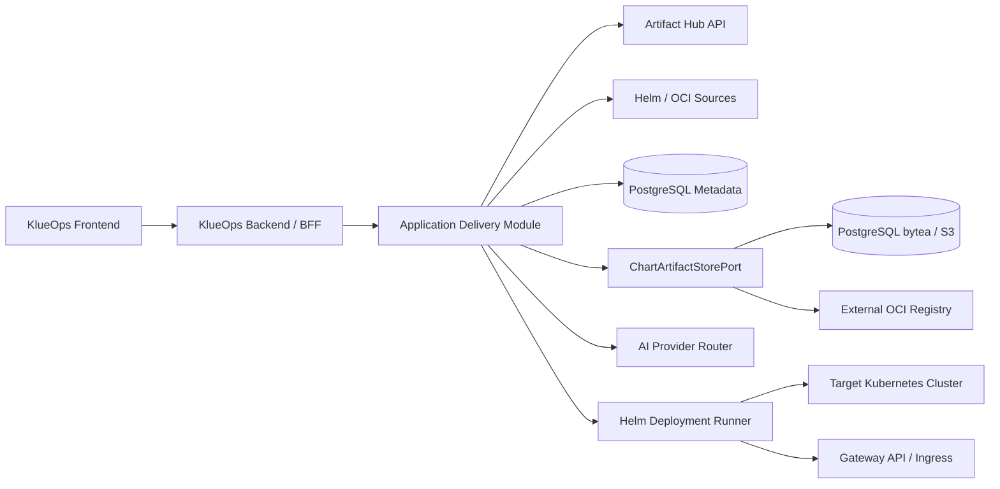
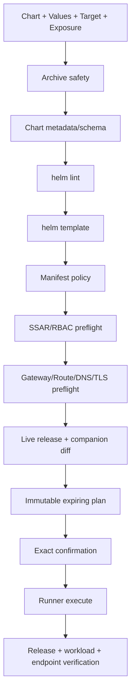

# Phase 2 Application Delivery Architecture

기준일: 2026-09-15

상태: 설계 완료, 구현 미착수

## 1. 결정

- 같은 KlueOps 저장소, 제품, Frontend와 Backend를 유지한다.
- Application Delivery는 Backend의 독립 bounded context로 구현한다.
- Helm CLI, Chart unpack/render와 Cluster mutation은 선택형 `Helm Deployment Runner`로 물리적으로 격리한다.
- 원본 Chart는 immutable artifact로 저장하고 Custom은 Values Profile만 지원한다.
- Application 기능은 feature flag로 끌 수 있고 비활성화 시 Runner도 설치하지 않는다.
- API와 port가 안정되고 독립 확장 요구가 생길 때만 Application Backend 서비스 추출을 검토한다.
- `DeploymentPlan`은 URL로 재진입할 수 있는 만료형 Wizard 상태이며 독립 메뉴의 영속 resource가 아니다.
- 실행 추적은 기존 Async Job/Job Center, 대상별 영속 이력은 Application/ReleaseOperation projection을 사용한다.
- Application Delivery 기능 개발 전 `P2-0`에서 기존 제품 전체 Frontend를 Phase 2 HTML 시안과 동일한 공통 design system으로 현대화한다.

### 1.1 P2-0 Frontend 기반 경계

P2-0은 Backend API나 기존 업무 기능을 재작성하지 않는다. `frontend/src/styles`의 semantic token과 shared style, 공통 Vue component, `frontend/src/api`, `utils`, `composables`, `stores`의 기존 경계를 유지하면서 화면별 중복 표현을 제거한다.

- global shell, page header, action bar, card/table/form, status/risk, loading/empty/error와 modal/drawer를 공통 primitive로 정리한다.
- route component는 page composition에 집중하고 long-running state는 기존 global Job Center store를 사용한다.
- 한 번에 전체 화면을 교체하지 않고 shell → 공통 primitive → 핵심 운영 화면 → 설정 화면 순으로 migration한다.
- 각 migration slice는 기존 API/permission/E2E 회귀, 1280/1440/1680 screenshot과 responsive/accessibility 검사를 통과해야 한다.
- 기존 1차 기능의 의미를 바꾸는 개선은 P2-0 visual refresh에 섞지 않고 별도 요구사항과 승인 대상으로 분리한다.

## 2. 논리 구조



Frontend는 하나를 유지한다. Browser가 Artifact Hub, Chart repository, AI Provider 또는 Runner에 직접 접근하지 않는다.

## 3. Backend package 경계

```text
io.strato.aiops.applicationdelivery
├─ domain
│  ├─ chart
│  ├─ values
│  ├─ deployment
│  ├─ exposure
│  └─ application
├─ application
│  ├─ port.in
│  ├─ port.out
│  └─ service
└─ adapter
   ├─ in.web
   ├─ out.artifacthub
   ├─ out.chartsources
   ├─ out.persistence
   ├─ out.ai
   └─ out.runner
```

기존 `AnalysisApplicationService`나 Cluster adapter 구현을 직접 호출하지 않는다. Tenant/Cluster/credential, audit, async job과 AI는 공개 application port를 사용한다.

ArchUnit gate:

- 기존 domain/application은 `applicationdelivery.adapter`를 참조하지 않는다.
- Application Delivery domain은 Spring, JPA, HTTP, Helm과 AI SDK를 참조하지 않는다.
- Helm argv 생성, temporary file과 process 실행은 Runner 밖에 존재하지 않는다.
- Provider-specific DTO는 application port를 통과하지 않는다.

## 4. Component 책임

### 4.1 Application Delivery Module

- Tenant/Workspace/Cluster 권한 평가
- Catalog search와 source metadata normalization
- Chart artifact/version과 Values Profile 관리
- AI Values suggestion orchestration
- preview 요청과 정책 결과 조립
- Cluster/Namespace target, Release name과 Namespace 생성 계획
- Chart-managed/KlueOps-managed Exposure 계획과 Gateway/DNS/TLS capability 조립
- exact confirmation과 async job lifecycle
- Application, Release metadata, workload/endpoint health, history, audit와 사후 검증

### 4.2 Helm Deployment Runner

- Chart archive 안전 검사와 bounded unpack
- `helm lint`, `helm template`, install/upgrade/status/history/rollback/uninstall
- Backend가 승인한 companion HTTPRoute/Ingress의 server-side apply/delete와 condition 조회
- argv allowlist, namespace/release 고정과 timeout/cancel
- 임시 kubeconfig, registry config, Chart와 Values의 job 종료 cleanup
- NDJSON progress와 bounded stdout/stderr

Runner는 DB, Ollama, Artifact Hub와 사용자 Browser에 접근하지 않는다. Backend만 token-authenticated ClusterIP로 호출하고 NetworkPolicy로 target API/source registry egress를 제한한다.

### 4.3 Chart 저장

metadata는 항상 PostgreSQL에 저장하고 artifact payload는 `ChartArtifactStorePort` 뒤에서 배포 profile에 따라 선택한다.

| Profile | Payload 저장 | 대상 | 판단 |
| --- | --- | --- | --- |
| `EMBEDDED_DB` | PostgreSQL `bytea` | 개인·개발·소규모 | 기본값, 추가 인프라 없음 |
| `OBJECT_STORAGE` | S3-compatible object | 많은 Tenant/Chart, 큰 backup | 운영 권장 선택지 |
| `EXTERNAL_OCI` | 기존 OCI registry를 digest로 참조하고 정책에 따라 cache | 조직 registry 보유 환경 | Registry 신규 설치 불필요 |

MVP는 새 필수 인프라를 추가하지 않기 위해 gzip package를 PostgreSQL `bytea`로 저장한다.

- upload/download 최대 20 MiB 기본값
- SHA-256 content-addressed deduplication
- Tenant reference와 artifact blob 분리
- compressed/uncompressed size, file count와 path 검사
- chart payload를 application log, audit 또는 AI prompt에 기록하지 않음

`OBJECT_STORAGE`는 DB에 object key, digest, size와 backend type만 저장한다. `EXTERNAL_OCI`도 mutable tag가 아니라 digest로 고정하며 source 장애와 rollback을 견뎌야 하는 정책에서는 immutable local cache를 유지한다. DB backup 크기와 복구 시간을 readiness에 표시한다.

KlueOps는 Harbor나 MinIO를 기본 dependency로 설치하지 않는다. 기존 인프라가 있으면 adapter로 연결하고 없는 소규모 설치는 Embedded DB를 사용한다.

Helm OCI 참고: <https://docs.helm.sh/docs/topics/registries/>

## 5. Domain model

```text
ChartSource
- id, tenantId
- type: ARTIFACT_HUB | HELM_REPOSITORY | OCI_REGISTRY | UPLOAD
- endpoint, credentialRef, tlsPolicy, enabled

TenantChart
- id, tenantId, name, description, sourceId
- trustStatus, archivedAt

ChartVersion
- id, tenantChartId
- chartVersion, appVersion
- sourceReference, digestSha256, provenanceStatus
- artifactId, metadataJson, importedBy, importedAt

ValuesProfile
- id, tenantId, chartVersionId, name, description

ValuesRevision
- id, profileId, revision
- valuesYamlEncrypted, valuesSha256
- redactedDiffJson, parentRevision, createdBy, createdAt

DeploymentPlan
- id, tenantId, workspaceId, clusterId, namespace
- chartVersionId, valuesRevisionId, releaseName
- namespacePlanId, exposurePlanId
- renderedManifestHash, policyResultJson, expiresAt
- confirmationText, status

Application
- id, tenantId, workspaceId, clusterId, namespace
- name, currentReleaseId?, lifecycleStatus, health, endpointHealth
- lifecycleStatus: DEPLOYING | ACTIVE | UPGRADING | ROLLING_BACK | UNINSTALLING | FAILED

ApplicationRelease
- id, applicationId
- releaseName, chartVersionId, valuesRevisionId
- helmRevision, status, health, lastOperationId

NamespacePlan
- id, clusterId, namespace, mode: EXISTING | CREATE
- quotaJson, limitRangeJson, networkPolicyProfile, policyResult

ExposurePlan
- id, deploymentPlanId, mode: INTERNAL_ONLY | CHART_MANAGED | KLUEOPS_MANAGED
- routeKind: NONE | HTTP_ROUTE | INGRESS
- gatewayRef, listenerName, hostname, path
- backendService, backendPort, tlsMode, tlsSecretRef, dnsMode
- renderedResourceHash, policyResult, expiresAt

ApplicationEndpoint
- id, applicationId, exposurePlanId
- url, routeRef, gatewayAddress, dnsStatus, tlsStatus
- acceptedStatus, resolvedRefsStatus, lastVerifiedAt

ManagedCompanionResource
- id, applicationId, operationId
- apiVersion, kind, namespace, name, manifestHash
- lifecycleStatus, retainedAt

ReleaseOperation
- id, applicationId, releaseId?, planId, asyncJobId
- type: INSTALL | UPGRADE | ROLLBACK | UNINSTALL | REFRESH
- status, requestedBy, startedAt, completedAt
- outputHash, errorCode, maskedError
```

Install 실행이 `202 Accepted`되면 같은 transaction에서 `Application(DEPLOYING)`, `ReleaseOperation`과 Async Job 연결을 만든다. 따라서 Helm 완료 전에도 Deployed Applications에서 대상과 상태를 찾을 수 있다. 성공 시 `ACTIVE`와 current Release를 확정하고 실패 시 `FAILED`와 안전한 retry/cleanup action을 제공한다. Uninstall 완료 후에는 기본 목록에서 제외하되 History/Audit 보존 정책에 따라 tombstone을 유지한다.

Job Center는 Async Job의 queue, progress, cancel과 일시적 실행 출력을 보여주는 전역 read model이다. Application Detail의 History는 `ReleaseOperation`을 기준으로 해당 대상의 install/upgrade/rollback/uninstall 결과와 Audit을 보여준다. 두 화면은 같은 `asyncJobId`로 연결하며 별도 Application Operations aggregate나 중복 API를 만들지 않는다.

Secret-like Values는 평문 검색, diff와 AI 전송에서 제외한다. DB 저장이 필요한 경우 기존 AES-256-GCM master key 계약으로 전체 Values payload를 암호화하고 key name과 mask만 UI에 노출한다.

## 6. Port 설계

```java
interface ChartCatalogPort {
    Page<ChartSummary> search(ChartSearchQuery query);
    ChartDetails details(ChartCoordinate coordinate);
}

interface ChartAcquisitionPort {
    AcquiredChart fetch(ChartFetchRequest request);
}

interface ChartArtifactStorePort {
    StoredChart put(TenantId tenantId, ValidatedChart chart);
    InputStream open(TenantId tenantId, ArtifactId artifactId);
}

interface HelmValuesSuggestionPort {
    ValuesSuggestion suggest(SanitizedValuesContext context);
}

interface HelmRunnerPort {
    PreviewResult preview(HelmPreviewRequest request);
    OperationHandle execute(ApprovedHelmOperation operation);
    void cancel(OperationId operationId);
}

interface ExposureCapabilityPort {
    ExposureCapabilities inspect(ClusterId clusterId, Namespace namespace);
    ExposureStatus status(ExposureReference reference);
}

interface ManagedResourceRunnerPort {
    ManagedResourceResult apply(ApprovedCompanionResources resources);
    ManagedResourceResult delete(ApprovedCompanionResources resources);
}
```

Runner는 임의 YAML을 받지 않는다. Backend가 schema와 allowlist로 만든 HTTPRoute/Ingress companion resource만 typed request로 전달하며 Cluster/Namespace/Gateway/Service는 plan과 일치해야 한다.

## 7. API 초안

```text
GET    /api/v2/application-delivery/catalog/search
GET    /api/v2/application-delivery/catalog/packages/{repository}/{name}
POST   /api/v2/application-delivery/charts/import
POST   /api/v2/application-delivery/charts/upload
GET    /api/v2/application-delivery/charts
GET    /api/v2/application-delivery/charts/{chartId}/versions
GET    /api/v2/application-delivery/chart-sources
POST   /api/v2/application-delivery/chart-sources
POST   /api/v2/application-delivery/chart-sources/{sourceId}/validate

POST   /api/v2/application-delivery/values-profiles
POST   /api/v2/application-delivery/values-profiles/{id}/revisions
POST   /api/v2/application-delivery/values-profiles/{id}/suggestions
GET    /api/v2/application-delivery/values-profiles/{id}/diff

POST   /api/v2/application-delivery/plans
GET    /api/v2/application-delivery/plans/{planId}
POST   /api/v2/application-delivery/plans/{planId}/execute
GET    /api/v2/application-delivery/targets/{clusterId}/namespaces
POST   /api/v2/application-delivery/namespace-plans
GET    /api/v2/application-delivery/exposure-capabilities/{clusterId}/{namespace}
POST   /api/v2/application-delivery/exposure-plans

GET    /api/v2/application-delivery/applications?lifecycleStatus=...
GET    /api/v2/application-delivery/applications/{applicationId}
GET    /api/v2/application-delivery/applications/{applicationId}/resources
GET    /api/v2/application-delivery/applications/{applicationId}/endpoints
GET    /api/v2/application-delivery/applications/{applicationId}/operations
POST   /api/v2/application-delivery/applications/{applicationId}/refresh
GET    /api/v2/application-delivery/releases
GET    /api/v2/application-delivery/releases/{releaseId}
POST   /api/v2/application-delivery/releases/{releaseId}/upgrade-plans
POST   /api/v2/application-delivery/releases/{releaseId}/rollback-plans
POST   /api/v2/application-delivery/releases/{releaseId}/uninstall-plans
```

모든 mutation은 idempotency key와 request/correlation ID를 받고 RFC 9457 Problem Detail을 반환한다. 장시간 동작은 `202 Accepted`와 기존 Async Job ID를 반환해 Job Center/Job Dock에서 추적한다. 전역 Job 조회 API는 기존 Platform Job API를 재사용하며 Application Delivery 전용 복제 endpoint를 만들지 않는다.

## 8. Preview pipeline



위험 신호는 `BLOCKED`, `REQUIRES_APPROVAL`, `WARNING`, `PASSED`로 표시한다. CRD, cluster-wide RBAC, webhook, privileged/host access, hook Job와 PVC 삭제 가능성은 별도 승인 없이는 실행하지 않는다.

### 8.1 Exposure 실행 순서

1. `helm template` 결과에서 Service와 chart-managed Ingress/HTTPRoute를 식별한다.
2. Chart-managed route가 있으면 중복 companion 생성을 차단한다.
3. KlueOps-managed mode는 Gateway API CRD, Gateway/Listener allowedRoutes, backend Service/Port와 RBAC를 검사한다.
4. Helm install/upgrade 성공 후 승인된 companion resource를 적용한다.
5. HTTPRoute `Accepted`와 `ResolvedRefs`, Gateway address, DNS와 TLS를 각각 독립 상태로 수집한다.
6. Route 적용 실패 시 `REQUIRED` 정책은 Helm rollback, `BEST_EFFORT` 정책은 Application을 `RUNNING_ENDPOINT_DEGRADED`로 표시하고 cleanup/재시도를 제공한다.
7. Rollback/Uninstall은 operation journal의 companion resource를 같은 plan에서 변경·정리한다.

Wildcard DNS가 Gateway를 가리키는 경우 hostname만 등록한다. 그렇지 않으면 선택형 DNS Provider/ExternalDNS adapter가 있을 때만 자동화를 제공하고, 없는 경우 필요한 record와 `MANUAL_ACTION_REQUIRED`를 표시한다.

Gateway API 참고: <https://gateway-api.sigs.k8s.io/reference/api-types/httproute/>, <https://gateway-api.sigs.k8s.io/guides/user-guides/http-routing/>

## 9. Chart acquisition 보안

- 허용 scheme은 HTTPS와 OCI로 제한한다.
- DNS resolve 후 loopback, link-local, metadata endpoint와 private range 접근을 정책에 따라 차단한다.
- redirect마다 목적지를 다시 검사한다.
- TLS 검증 해제는 production에서 허용하지 않는다.
- filename이 아니라 server-generated artifact ID로 저장한다.
- tar entry의 absolute path, `..`, symlink/hardlink와 device file을 거부한다.
- compressed/uncompressed byte와 file count budget을 적용한다.
- Helm plugin, post-renderer와 임의 downloader plugin을 허용하지 않는다.
- provenance가 없으면 `CHECKSUMMED`, 검증 실패면 `REJECTED`로 처리한다.

## 10. Helm 실행 보안

- Backend가 생성한 enum operation을 Runner가 고정 argv로 변환한다.
- Cluster/Namespace/Release name은 plan 값과 정확히 일치해야 한다.
- credential은 operation TTL 동안만 메모리/ephemeral volume에 존재한다.
- Runner ServiceAccount 자체에는 target Cluster 권한을 주지 않는다.
- 동시 실행은 user/Tenant/Cluster별로 제한한다.
- `--atomic`, `--wait`, timeout과 cleanup-on-fail 정책을 Chart 위험 등급별로 결정한다.
- stdout/stderr는 Secret masking 후 상한까지 streaming하고 원본은 저장하지 않는다.
- 취소/Pod 재시작 후 Helm release 상태를 조회해 `SUCCEEDED`, `FAILED`, `UNKNOWN_REQUIRES_REVIEW`로 복구한다.
- Namespace 생성, Exposure apply와 cleanup도 동일 operation journal, idempotency key와 bounded retry를 사용한다.
- Helm uninstall과 companion cleanup은 단계별 결과를 남기며 PVC, DNS와 TLS 보존 선택을 plan 밖에서 변경하지 않는다.

## 11. Feature flag와 배포

```yaml
portal:
  applicationDelivery:
    enabled: false
    maximumChartBytes: 20971520
    maximumRenderedBytes: 5242880
    artifactStore:
      type: embedded-db
    artifactHub:
      enabled: true
    helmRunner:
      enabled: false
    exposure:
      gatewayApi: true
      ingressFallback: false
      dnsAutomation: false
```

비활성화 시 메뉴와 API는 capability endpoint에 나타나지 않고 Runner Deployment/Service/NetworkPolicy를 렌더링하지 않는다. 기존 Cluster 분석과 Command Runner 동작에는 영향이 없어야 한다.

## 12. 추출 전략

다음 조건이 실제로 발생할 때 Application Delivery Module을 별도 Backend 서비스로 추출한다.

- Core와 독립적인 release/scale/SLA가 필요함
- Chart Library가 object storage와 독립 worker pool을 요구함
- Helm operation volume이 분석 job resource를 방해함
- 독립 개발팀 또는 KlueOps 외부 API consumer가 생김

추출 전까지 같은 DB transaction과 기존 Tenant/Cluster credential 경계를 재사용한다. 추출 시에도 다른 서비스가 raw Cluster credential을 가져가는 API를 만들지 않고 job-bound credential envelope 또는 cluster-side connector를 별도 설계한다.

## 13. 검증 전략

- Domain/port unit test와 adapter fake
- Artifact Hub contract fixture와 timeout/rate-limit fallback
- malicious tar, SSRF redirect, oversized Chart와 provenance test
- Tenant A/B object scope와 capability matrix test
- fake AI provider의 schema/timeout/masking test
- ephemeral namespace에서 install → upgrade → rollback → uninstall E2E
- 기존/신규 Namespace 권한, quota와 uninstall 시 Namespace 보존 test
- Internal/Chart-managed/KlueOps-managed Exposure와 중복 Route 차단 test
- HTTPRoute Accepted/ResolvedRefs, Gateway allowedRoutes, DNS/TLS partial 상태 test
- Application Workload/Pod/Endpoint 조회와 Tenant scope test
- companion apply 실패, Helm rollback, uninstall cleanup과 retained resource test
- Embedded DB/Object Storage/External OCI artifact store contract test
- CRD/RBAC/hook/privileged/PVC 위험 Chart 차단 test
- Runner cancel/restart/idempotency와 output truncation test
- Application 기능 비활성화 시 기존 quality gate regression
