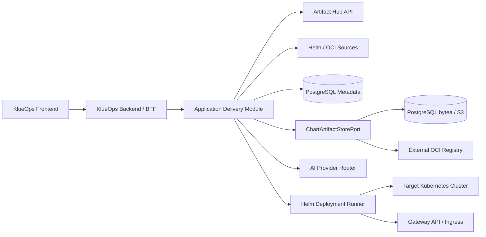
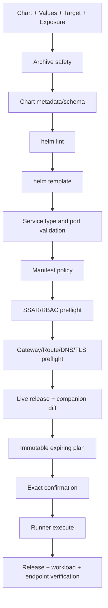

# Phase 2 Application Delivery Architecture

## Values 요청 해석 및 매핑 API

화면은 `POST /api/v2/application-delivery/values-assistance/jobs`로 비동기 생성을 시작한다. Tenant feature, Values 편집 권한과 요청 사용자 소유권을 확인한다. `HelmValuesAssistanceService`의 단일 엔진이 원문 참조 조회와 생성·검증·제한 교정을 수행하고 `HelmValuesMapping`이 기존 Values에 변경을 합성한다. 결과는 `HELM_TEMPLATE_VALIDATED`, `NEEDS_INPUT`, `GENERATION_FAILED`로 구분한다. 암호화 저장, 전용 bounded executor, Job ID 복원과 원본 Values digest 검사를 적용한다. 상세 계약은 [고도화 설계](values-assistant-redesign.md)를 따른다.

기준일: 2026-09-17

상태: Phase 2 bounded context와 UI 구현·main 병합 완료, OCI/S3 저장 adapter·자동 DNS/TLS만 후속

구현 기준선은 PostgreSQL metadata/artifact 저장, Backend 내부 Application Delivery port/service/adapter, 임시 kubeconfig를 사용하는 제한된 Helm CLI 실행, Chart-managed route 검증, Service 기반 HTTPRoute·Ingress·TCPRoute companion, ReferenceGrant/allowedRoutes preflight, Async Job과 ReleaseOperation 복구다. OCI/Object Storage와 DNS/TLS Provider는 실제 확장 조건이 생길 때 적용한다.

### 2026-09-16 승인 확장 설계

- Values 계약 API가 immutable Chart archive의 기본 `values.yaml`과 `values.schema.json`을 제공하고, Frontend는 지원 scalar만 Form으로 노출한다. Secret 추정 경로와 배열·복합 구조는 YAML 편집으로 유지한다.
- `aiops.application-delivery.provenance-keyring`이 설정되면 `helm pull --verify --keyring`을 강제한다. 서명 위조는 import 실패, `.prov` 미제공은 `CHECKSUMMED`, 성공은 `VERIFIED`다.
- HTTPRoute/TCPRoute cross-namespace backend는 Service 실재와 ReferenceGrant의 from/to/group/kind/name을 모두 검사한다. Listener는 route kind, protocol, allowedRoutes kind와 Namespace selector를 모두 통과해야 한다.
- Uninstall 보존 정책은 worker 제출 시 immutable 인자로 전달한다. PVC/TLS 보존은 Helm keep annotation, 비보존은 release label 범위 삭제, DNS 경로 비보존은 companion 삭제로 실행한다. 실패 Application은 새 Job의 cleanup retry만 허용한다.
- Local model은 모든 Tenant routing 참조를 조회해 사용 중 삭제를 차단한다. 6개 고정 corpus를 실제 Ollama `/api/generate`에 실행해 80점·6 sample·9B 이하 gate를 통과한 경우에만 Profile 기본 모델로 승격한다.
- Playwright가 22개 정적 product route를 desktop/mobile snapshot으로 관리하며, 전역 modal observer가 role/aria-modal 보완, 최초 focus, Tab 순환과 trigger focus 복원을 담당한다.

## 1. 결정

- 같은 KlueOps 저장소, 제품, Frontend와 Backend를 유지한다.
- Application Delivery는 Backend의 독립 bounded context로 구현한다.
- Helm CLI, Chart unpack/render와 Cluster mutation은 선택형 `Helm Deployment Runner`로 물리적으로 격리한다.
- 원본 Chart는 immutable artifact로 저장하고 Custom은 Values Profile만 지원한다.
- Application 기능은 feature flag로 끌 수 있고 비활성화 시 Runner도 설치하지 않는다.
- API와 port가 안정되고 독립 확장 요구가 생길 때만 Application Backend 서비스 추출을 검토한다.
- `DeploymentPlan`은 URL로 재진입할 수 있는 만료형 Wizard 상태이며 독립 메뉴의 영속 resource가 아니다.
- Applications의 배포 시작 chooser는 Library/Discover/Direct Import의 진입점만 결정한다. Chart version이 확정된 뒤에만 `DeploymentPlan`을 만들며, chooser나 catalog 탐색 단계에서는 Cluster write 권한을 요구하지 않는다.
- 실행 추적은 기존 Async Job/Job Center, 대상별 영속 이력은 Application/ReleaseOperation projection을 사용한다.
- Application Delivery 기능 개발 전 `P2-0`에서 기존 제품 전체 Frontend를 Phase 2 HTML 시안과 동일한 공통 design system으로 현대화한다.
- P2-A에서 scope별 effective capability와 Tenant feature policy, User membership/offboarding, 기존 Cluster 파생 ownership query guard를 먼저 완료한다. 세부 계약은 이 문서의 Domain model과 Access API를 기준으로 한다.

### 1.1 P2-0 Frontend 기반 경계

P2-0은 Backend API나 기존 업무 기능을 재작성하지 않는다. `frontend/src/styles`의 semantic token과 shared style, 공통 Vue component, `frontend/src/api`, `utils`, `composables`, `stores`의 기존 경계를 유지하면서 화면별 중복 표현을 제거한다.

- global shell, page header, action bar, card/table/form, status/risk, loading/empty/error와 modal/drawer를 공통 primitive로 정리한다.
- route component는 page composition에 집중하고 long-running state는 기존 global Job Center store를 사용한다.
- 인증 route 전체가 `App.vue`의 공통 shell과 `product-shell.css`를 사용한다. 화면별 업무 CSS는 이 기반 위에 composition만 확장한다.
- 각 migration slice는 기존 API/permission/E2E 회귀, 1280/1440/1680 screenshot과 responsive/accessibility 검사를 통과해야 한다.
- 기존 1차 기능의 의미를 바꾸는 개선은 P2-0 visual refresh에 섞지 않고 별도 요구사항과 승인 대상으로 분리한다.

실제 공통 shell은 dark navigation, sticky Tenant/Workspace context bar, global search/notification action과 mobile overlay navigation으로 구성한다. Applications의 목록·inspector는 해당 shell의 semantic token을 사용하며, 과도한 wide card 확장을 방지하기 위해 최대 content width와 명시적 responsive breakpoint를 둔다.

## 2. 논리 구조



Frontend는 하나를 유지한다. Browser가 Artifact Hub, Chart repository, AI Provider 또는 Runner에 직접 접근하지 않는다.

## 3. Backend package 경계

```text
io.strato.aiops.applicationdelivery
├─ domain
│  ├─ chart
│  ├─ values
│  ├─ deployment
│  ├─ exposure
│  └─ application
├─ application
│  ├─ port.in
│  ├─ port.out
│  └─ service
└─ adapter
   ├─ in.web
   ├─ out.artifacthub
   ├─ out.chartsources
   ├─ out.persistence
   ├─ out.ai
   └─ out.runner
```

기존 `AnalysisApplicationService`나 Cluster adapter 구현을 직접 호출하지 않는다. Tenant/Cluster/credential, audit, async job과 AI는 공개 application port를 사용한다.

ArchUnit gate:

- 기존 domain/application은 `applicationdelivery.adapter`를 참조하지 않는다.
- Application Delivery domain은 Spring, JPA, HTTP, Helm과 AI SDK를 참조하지 않는다.
- Helm argv 생성, temporary file과 process 실행은 Runner 밖에 존재하지 않는다.
- Provider-specific DTO는 application port를 통과하지 않는다.

## 4. Component 책임

### 4.1 Application Delivery Module

- Tenant/Workspace/Cluster 권한 평가
- Catalog search와 source metadata normalization
- Chart artifact/version과 Values Profile 관리
- AI Values suggestion orchestration
- preview 요청과 정책 결과 조립
- Cluster/Namespace target, Release name과 Namespace 생성 계획
- Chart-managed/KlueOps HTTPRoute Exposure 계획과 Gateway/DNS/TLS capability 조립
- exact confirmation과 async job lifecycle
- Application, Release metadata, workload/endpoint health, history, audit와 사후 검증

### 4.2 Helm Deployment Runner

- Chart archive 안전 검사와 bounded unpack
- `helm lint`, `helm template`, install/upgrade/status/history/rollback/uninstall
- Backend가 승인한 companion HTTPRoute의 server-side apply/delete와 condition 조회
- argv allowlist, namespace/release 고정과 timeout/cancel
- 임시 kubeconfig, registry config, Chart와 Values의 job 종료 cleanup
- NDJSON progress와 bounded stdout/stderr

Runner는 DB, Ollama, Artifact Hub와 사용자 Browser에 접근하지 않는다. Backend만 token-authenticated ClusterIP로 호출하고 NetworkPolicy로 target API/source registry egress를 제한한다.

### 4.3 Chart 저장

metadata는 항상 PostgreSQL에 저장하고 artifact payload는 `ChartArtifactStorePort` 뒤에서 배포 profile에 따라 선택한다.

| Profile | Payload 저장 | 대상 | 판단 |
| --- | --- | --- | --- |
| `EMBEDDED_DB` | PostgreSQL `bytea` | 개인·개발·소규모 | 기본값, 추가 인프라 없음 |
| `OBJECT_STORAGE` | S3-compatible object | 많은 Tenant/Chart, 큰 backup | 운영 권장 선택지 |
| `EXTERNAL_OCI` | 기존 OCI registry를 digest로 참조하고 정책에 따라 cache | 조직 registry 보유 환경 | Registry 신규 설치 불필요 |

MVP는 새 필수 인프라를 추가하지 않기 위해 gzip package를 PostgreSQL `bytea`로 저장한다.

- upload/download 최대 20 MiB 기본값
- SHA-256 content-addressed deduplication
- Tenant reference와 artifact blob 분리
- compressed/uncompressed size, file count와 path 검사
- chart payload를 application log, audit 또는 AI prompt에 기록하지 않음

`OBJECT_STORAGE`는 DB에 object key, digest, size와 backend type만 저장한다. `EXTERNAL_OCI`도 mutable tag가 아니라 digest로 고정하며 source 장애와 rollback을 견뎌야 하는 정책에서는 immutable local cache를 유지한다. DB backup 크기와 복구 시간을 readiness에 표시한다.

KlueOps는 Harbor나 MinIO를 기본 dependency로 설치하지 않는다. 기존 인프라가 있으면 adapter로 연결하고 없는 소규모 설치는 Embedded DB를 사용한다.

Helm OCI 참고: <https://docs.helm.sh/docs/topics/registries/>

## 5. Domain model

Chart/Source/Values처럼 Tenant가 직접 공유하는 Resource는 `tenantId`를 소유한다. Analysis/Application처럼 Cluster가 필수인 Resource는 중복 `tenantId`, `workspaceId`를 저장하지 않고 불변인 Cluster ownership에서 유도한다. 이 경우 모든 repository query는 Cluster를 join해 현재 Tenant를 검사하고 Cluster hard delete와 일반 Tenant 이동을 금지한다. Platform Manager만 명시적인 cross-tenant query를 사용할 수 있다.

### 5.1 Access aggregate와 현재 migration gap

현재 Session capability는 모든 RoleBinding의 union이고 표준 OIDC Group이 Platform scope 권한으로 해석될 수 있다. P2-A에서는 선택한 Tenant/Workspace별 `effectiveCapabilities`로 바꾸고, 명시적으로 등록된 Platform Manager Group 외의 implicit Platform mapping을 제거한다. 기존 `/api/security/users`는 Platform Manager용 directory 진단으로 제한하고 Tenant 구성원 관리는 별도 scoped API로 분리한다.

기존 저장 enum `PLATFORM_ADMIN`은 migration 동안 Platform Manager의 호환 이름으로 읽되 UI에는 `Platform Manager`만 표시한다. DB/API migration이 끝나면 저장 enum도 `PLATFORM_MANAGER`로 정리한다.

```text
TenantMembership
- id, tenantId, userId?, pendingIssuer?, pendingSubject?, pendingEmail?
- status: INVITED | ACTIVE | SUSPENDED | OFFBOARDED
- createdBy, createdAt, suspendedAt?, offboardedAt?

TenantFeaturePolicy
- tenantId, featureKey, enabled, updatedBy, updatedAt

OidcGroupMapping
- id, issuer, groupValue, tenantId, role, scopeType
- workspaceId?, clusterId?, namespace?, active, createdBy, createdAt
```

`issuer + groupValue + tenantId + role + scope`는 unique이며 저장 시 Cluster/Workspace가 같은 Tenant인지 검증한다. Group Mapping과 사용자 직접 RoleBinding의 grant는 합집합이고 MVP에 deny는 없다. 변경 시 access revision을 증가시켜 다음 요청부터 장기 Session도 재평가한다.

### 5.2 Ownership 불변성과 query 규칙

- Tenant 직접 소유: Tenant, Workspace, Membership, FeaturePolicy, Chart/Version/Source, Values Profile/Revision, Tenant AI routing/BYOK profile.
- Cluster 파생 소유: Analysis/evidence, Managed Application, DeploymentPlan, ReleaseOperation, CompanionResource, Cluster Incident/Signal, Cluster 작업 Job/Notification.
- Tenant 직접 소유 repository는 `tenantId`, Cluster 파생 repository는 `tenantId + clusterId`를 필수 인자로 받고 ID 단독 조회 method를 노출하지 않는다.
- Cluster 파생 조회는 `child JOIN clusters ON child.cluster_id = clusters.id WHERE clusters.tenant_id = :currentTenantId`를 강제한다.
- Cluster의 `tenant_id/workspace_id`는 생성 후 불변이고 hard delete 대신 soft delete 또는 FK `RESTRICT`를 사용한다.
- Application을 참조하는 Analysis는 `(application_id, cluster_id)` composite FK 또는 동일 Cluster 검증으로 cross-cluster 연결을 차단한다.

### 5.3 Application Delivery model

```text
ChartSource
- id, tenantId
- type: ARTIFACT_HUB | HELM_REPOSITORY | OCI_REGISTRY | UPLOAD
- endpoint, credentialRef, tlsPolicy, enabled

TenantChart
- id, tenantId, name, description, sourceId
- trustStatus, archivedAt

ChartVersion
- id, tenantChartId
- chartVersion, appVersion
- sourceReference, digestSha256, provenanceStatus
- artifactId, metadataJson, importedBy, importedAt

ValuesProfile
- id, tenantId, chartVersionId, name, description

ValuesRevision
- id, profileId, revision
- valuesYamlEncrypted, valuesSha256
- redactedDiffJson, parentRevision, createdBy, createdAt

DeploymentPlan
- id, clusterId, namespace
- chartVersionId, valuesRevisionId, releaseName
- namespacePlanId, exposurePlanId
- renderedManifestHash, policyResultJson, expiresAt
- confirmationText, status

Application
- id, clusterId, namespace
- name, currentReleaseId?, lifecycleStatus, health, endpointHealth
- lifecycleStatus: DEPLOYING | ACTIVE | UPGRADING | ROLLING_BACK | UNINSTALLING | FAILED

ApplicationRelease
- id, applicationId
- releaseName, chartVersionId, valuesRevisionId
- helmRevision, status, health, lastOperationId

NamespacePlan
- id, clusterId, namespace, mode: EXISTING | CREATE
- quotaJson, limitRangeJson, networkPolicyProfile, policyResult

ExposurePlan
- id, deploymentPlanId, mode: NONE | CHART_MANAGED | HTTP_ROUTE
- routeKind: NONE | HTTP_ROUTE | INGRESS
- gatewayRef, listenerName, hostname, path
- backendService, backendPort, tlsMode, tlsSecretRef, dnsMode
- renderedResourceHash, policyResult, expiresAt

ApplicationEndpoint
- id, applicationId, exposurePlanId
- url, routeRef, gatewayAddress, dnsStatus, tlsStatus
- acceptedStatus, resolvedRefsStatus, lastVerifiedAt

ManagedCompanionResource
- id, applicationId, operationId
- apiVersion, kind, namespace, name, manifestHash
- lifecycleStatus, retainedAt

ReleaseOperation
- id, applicationId, releaseId?, planId, asyncJobId
- type: INSTALL | UPGRADE | ROLLBACK | UNINSTALL | REFRESH
- status, requestedBy, startedAt, completedAt
- outputHash, errorCode, maskedError
```

Install 실행이 `202 Accepted`되면 같은 transaction에서 `Application(DEPLOYING)`, `ReleaseOperation`과 Async Job 연결을 만든다. 따라서 Helm 완료 전에도 Deployed Applications에서 대상과 상태를 찾을 수 있다. 성공 시 `ACTIVE`와 current Release를 확정하고 실패 시 `FAILED`와 안전한 retry/cleanup action을 제공한다. Uninstall 성공 시 Endpoint → Release → ReleaseOperation → 소비된 Plan → ManagedApplication 순서로 하나의 짧은 DB transaction에서 삭제하며 tombstone은 유지하지 않는다. Helm Release 생성 전에 설치가 실패한 Application도 `helm uninstall --ignore-not-found`로 cleanup을 완료할 수 있다. Phase 2 전환 시 이전 버전에서 남은 `UNINSTALLED` 수명주기 데이터도 같은 순서로 한 번 정리한다. Async Job 결과는 Application FK와 독립된 최소 실행 증거로 보존한다.

Application Delivery worker는 위 transaction이 commit된 뒤에만 bounded executor에 제출한다. `saveAndFlush` 직후 다른 thread를 시작하는 방식은 미커밋 행 조회 경쟁을 만들기 때문에 허용하지 않는다. rollback이면 worker를 제출하지 않고, executor 포화나 worker 시작부 예외는 `REQUIRES_NEW` 실패 기록으로 Job, Application과 ReleaseOperation을 함께 종결한다. 서로 다른 Release는 Backend instance당 기본 core 2·max 4·queue 30 범위에서 병렬 실행하며, 같은 Application의 upgrade/rollback/uninstall은 PostgreSQL row lock과 active 상태 검증으로 중복 실행을 거부한다. 신규 install의 동일 `Cluster + Namespace + Release` 경합은 unique constraint를 최종 방어선으로 사용하고 `409 APPLICATION_OPERATION_CONFLICT`로 응답한다.

Job Center는 Async Job의 queue, progress, cancel과 일시적 실행 출력을 보여주는 전역 read model이다. Application Detail의 History는 `ReleaseOperation`을 기준으로 해당 대상의 install/upgrade/rollback/uninstall 결과와 Audit을 보여준다. 두 화면은 같은 `asyncJobId`로 연결하며 별도 Application Operations aggregate나 중복 API를 만들지 않는다.

Secret-like Values는 평문 검색, diff와 AI 전송에서 제외한다. DB 저장이 필요한 경우 기존 AES-256-GCM master key 계약으로 전체 Values payload를 암호화하고 key name과 mask만 UI에 노출한다. AI 전송 전 민감 key 값을 `***REDACTED***`로 치환하고, 제안 검증 후에는 사용자가 입력한 원래 값을 서버에서 복원하므로 marker가 실제 Revision 값으로 저장되지 않는다.

Values 제안은 `helm-values.grounded.v2`를 사용한다. 고정 2단계 호출, application별 intent/key 추정, 잘린 원문 생성과 평문 credential 제거 후 부분 성공 경로를 제거했다. `HelmValuesReferences`가 실제 원문·주석·dependency와 정적 템플릿 경로를 주소화하고, 모델이 필요한 자료를 요청한다. 검증은 YAML·Chart 경로·Helm lint/template·렌더 조건 순서이다. 수동 Revision도 동일한 Chart 검증을 통과해야 한다. 기존 Secret을 보호/복원하며 모델에 원문 credential이나 렌더 manifest를 보내지 않는다. 최대 5회 모델 호출과 최대 2회 교정을 적용한다. Ollama JSON 출력과 입력/출력 예산을 사용한다. 상세 책임, 자원 상한, 안전한 교정 피드백, 알려진 제한과 실제 인수 결과는 [고도화 설계](values-assistant-redesign.md)에 모아 관리한다.

Chart Library 제거는 `tenant_charts.archived_at`을 갱신하는 soft archive다. `chart_versions`, 암호화 Values profile/revision, 배포 plan과 Application release FK는 그대로 유지해 실행 중 Application과 rollback 이력을 손상하지 않는다. 동일 Tenant/source/package를 다시 가져오면 기존 Chart를 복원하고 digest가 같은 immutable version을 재사용한다.

## 6. Port 설계

```java
interface ChartCatalogPort {
    Page<ChartSummary> search(ChartSearchQuery query);
    ChartDetails details(ChartCoordinate coordinate);
}

interface ChartAcquisitionPort {
    AcquiredChart fetch(ChartFetchRequest request);
}

interface ChartArtifactStorePort {
    StoredChart put(TenantId tenantId, ValidatedChart chart);
    InputStream open(TenantId tenantId, ArtifactId artifactId);
}

interface HelmValuesSuggestionPort {
    String suggest(TenantId tenantId, ExactChartValuesContext context);
}

interface HelmRunnerPort {
    PreviewResult preview(HelmPreviewRequest request);
    OperationHandle execute(ApprovedHelmOperation operation);
    void cancel(OperationId operationId);
}

interface ExposureCapabilityPort {
    ExposureCapabilities inspect(ClusterId clusterId, Namespace namespace);
    ExposureStatus status(ExposureReference reference);
}

interface ManagedResourceRunnerPort {
    ManagedResourceResult apply(ApprovedCompanionResources resources);
    ManagedResourceResult delete(ApprovedCompanionResources resources);
}
```

Runner는 임의 YAML을 받지 않는다. Backend가 schema와 allowlist로 만든 HTTPRoute/Ingress companion resource만 typed request로 전달하며 Cluster/Namespace/Gateway/Service는 plan과 일치해야 한다.

## 7. API 초안

### 7.1 Access와 User lifecycle

Session은 전역 capability union 대신 선택 scope의 access contract를 반환한다.

```json
{
  "platformRole": "PLATFORM_MANAGER",
  "selectedScope": { "tenantId": "...", "workspaceId": "..." },
  "effectiveCapabilities": ["cluster:read", "application:deploy"],
  "enabledFeatures": ["CORE_OVERVIEW", "APPLICATION_DELIVERY"],
  "navigation": [{ "key": "applications", "visible": true }]
}
```

```text
GET    /api/me/access?tenantId=&workspaceId=
GET    /api/tenants/{tenantId}/members
POST   /api/tenants/{tenantId}/members
PATCH  /api/tenants/{tenantId}/members/{membershipId}
POST   /api/tenants/{tenantId}/members/{membershipId}/offboard-plan
POST   /api/tenants/{tenantId}/members/{membershipId}/offboard
GET    /api/tenants/{tenantId}/features
PATCH  /api/tenants/{tenantId}/features
GET    /api/tenants/{tenantId}/oidc-group-mappings
POST   /api/tenants/{tenantId}/oidc-group-mappings
PATCH  /api/tenants/{tenantId}/oidc-group-mappings/{mappingId}
DELETE /api/tenants/{tenantId}/oidc-group-mappings/{mappingId}
```

Backend는 body의 `tenantId`를 신뢰하지 않고 선택 scope와 parent Resource에서 Tenant를 유도한다. 다른 Tenant Resource에는 404, capability 부족에는 403, 비활성 Feature에는 `FEATURE_DISABLED` Problem Detail을 반환한다. Platform Manager의 cross-tenant 조회는 명시적인 all-tenants query로만 허용한다.

Keycloak 관리 adapter는 User 생성, required action과 계정 비활성화를 제공한다. 일반 외부 OIDC adapter는 pending membership만 만들며 비밀번호를 다루지 않는다. Offboard 실행은 plan hash와 exact username을 검증한 뒤 RoleBinding/session/personal credential을 한 transaction 경계에서 회수하고, 실행 중 Job 처리와 IdP 결과는 보상 가능한 step으로 기록한다. 마지막 Platform Manager 대상 plan은 생성 단계부터 차단한다.

### 7.2 Application Delivery

```text
GET    /api/v2/application-delivery/catalog/search
GET    /api/v2/application-delivery/catalog/packages/{repository}/{name}
POST   /api/v2/application-delivery/charts/import
POST   /api/v2/application-delivery/charts/upload
GET    /api/v2/application-delivery/charts
GET    /api/v2/application-delivery/charts/{chartId}/versions
GET    /api/v2/application-delivery/chart-sources
POST   /api/v2/application-delivery/chart-sources
POST   /api/v2/application-delivery/chart-sources/{sourceId}/validate

POST   /api/v2/application-delivery/values-profiles
POST   /api/v2/application-delivery/values-profiles/{id}/revisions
POST   /api/v2/application-delivery/values-profiles/{id}/suggestions
GET    /api/v2/application-delivery/values-profiles/{id}/diff

POST   /api/v2/application-delivery/plans
GET    /api/v2/application-delivery/plans/{planId}
POST   /api/v2/application-delivery/plans/{planId}/execute
GET    /api/v2/application-delivery/targets/{clusterId}/namespaces
POST   /api/v2/application-delivery/namespace-plans
GET    /api/v2/application-delivery/exposure-capabilities/{clusterId}/{namespace}
POST   /api/v2/application-delivery/exposure-plans

GET    /api/v2/application-delivery/applications?lifecycleStatus=...
GET    /api/v2/application-delivery/applications/{applicationId}
GET    /api/v2/application-delivery/applications/{applicationId}/resources
GET    /api/v2/application-delivery/applications/{applicationId}/endpoints
GET    /api/v2/application-delivery/applications/{applicationId}/operations
POST   /api/v2/application-delivery/applications/{applicationId}/refresh
GET    /api/v2/application-delivery/releases
GET    /api/v2/application-delivery/releases/{releaseId}
POST   /api/v2/application-delivery/releases/{releaseId}/upgrade-plans
POST   /api/v2/application-delivery/releases/{releaseId}/rollback-plans
POST   /api/v2/application-delivery/releases/{releaseId}/uninstall-plans
```

모든 mutation은 idempotency key와 request/correlation ID를 받고 RFC 9457 Problem Detail을 반환한다. 장시간 동작은 `202 Accepted`와 기존 Async Job ID를 반환해 Job Center/Job Dock에서 추적한다. 전역 Job 조회 API는 기존 Platform Job API를 재사용하며 Application Delivery 전용 복제 endpoint를 만들지 않는다.

## 8. Preview pipeline



위험 신호는 `BLOCKED`, `REQUIRES_APPROVAL`, `WARNING`, `PASSED`로 표시한다. CRD, cluster-wide RBAC, webhook, privileged/host access, hook Job와 PVC 삭제 가능성은 별도 승인 없이는 실행하지 않는다.

Helm 3 release metadata는 대상 Namespace의 Secret에 저장된다. Backend는 Preview와 비동기 install/upgrade 직전에 등록 Cluster credential로 SelfSubjectAccessReview를 수행해 Secret `get/list/create` 최소 권한을 확인한다. Namespace 목록 조회 권한만 있는 대상을 배포 가능 대상으로 오인하지 않으며, 거부된 verb와 Namespace를 사용자에게 표시한다. 이 원격 검증 중에는 DB transaction을 유지하지 않는다.

### 8.1 Exposure 실행 순서

1. Target option 조회 API가 고정된 Chart/Values를 `helm template`로 렌더링해 Service namespace/name/type과 `spec.ports[].port`, `targetPort`, `nodePort`를 추출한다. 렌더링된 모든 Service에서 `nodePort`가 `NodePort` 또는 `LoadBalancer`에만 존재하고 Kubernetes 기본 범위 `30000-32767` 안인지 먼저 검사하며, 위반하면 Revision 저장·Target 조회·Preview를 같은 오류로 차단한다. 통과한 뒤에만 별도 Kubernetes 조회로 Gateway와 HTTP/HTTPS listener, `Accepted/Programmed` 상태를 반환한다. 원격 조회 중 DB transaction은 유지하지 않는다.
2. `CHART_MANAGED`는 렌더 결과에 top-level Ingress 또는 HTTPRoute가 없으면 preview를 거부한다.
3. `HTTP_ROUTE`는 Preview와 비동기 Helm 실행 직전에 Gateway API CRD와 parent Gateway, HTTP/HTTPS listener, listener `allowedRoutes`의 Namespace admission, Gateway 준비 상태, backend Service와 `spec.ports[].port`를 재검사한다. Service `appProtocol`, port name과 알려진 포트로 명백한 비-HTTP TCP endpoint를 제외한다. 조회와 실행 사이에 Gateway가 삭제되거나 준비 해제된 경우 Helm 변경 전에 실패시킨다.
4. Helm install/upgrade 성공 후 승인된 companion HTTPRoute를 server-side apply한다.
5. Helm 소유 label 또는 release annotation으로 chart-managed Ingress를 찾고 TLS 유무에 맞춰 URL을 만든다.
6. HTTPRoute `Accepted`와 `ResolvedRefs`를 수집하고 두 조건이 모두 참이면 `READY`, 거부 조건이면 `DEGRADED`, 아직 판정 전이면 `APPLIED`로 표시한다.
7. companion 적용 실패는 생성 시도한 Route를 best-effort 정리하고 추정 URL을 저장하지 않는다.
8. Gateway API와 Controller 설치는 Tenant Cluster Admin 책임이며 KlueOps가 자동 설치하지 않는다. 자동 DNS/TLS, cross-namespace backend `ReferenceGrant`, Gateway address 기반 도달성 판단과 companion Ingress/TCPRoute는 후속 adapter 범위다.

PostgreSQL·Redis처럼 raw TCP를 사용하는 workload는 HTTPRoute의 대상이 아니다. 로컬 개발에서는 port-forward, 일반 운영에서는 Cluster 정책에 맞는 NodePort/LoadBalancer 또는 TCP listener와 TCPRoute를 사용한다. KlueOps가 TCPRoute 배포를 지원하기 전까지 해당 Service는 HTTPRoute 선택 목록에서 비활성화하고 Preview에서도 이중 차단한다.

Wildcard DNS가 Gateway를 가리키는 경우 hostname만 등록한다. 그렇지 않으면 선택형 DNS Provider/ExternalDNS adapter가 있을 때만 자동화를 제공하고, 없는 경우 필요한 record와 `MANUAL_ACTION_REQUIRED`를 표시한다.

Gateway API 참고: <https://gateway-api.sigs.k8s.io/reference/api-types/httproute/>, <https://gateway-api.sigs.k8s.io/guides/user-guides/http-routing/>

## 9. Chart acquisition 보안

- 허용 scheme은 HTTPS와 OCI로 제한한다.
- DNS resolve 후 loopback, link-local, metadata endpoint와 private range 접근을 정책에 따라 차단한다.
- redirect마다 목적지를 다시 검사한다.
- TLS 검증 해제는 production에서 허용하지 않는다.
- filename이 아니라 server-generated artifact ID로 저장한다.
- tar entry의 absolute path, `..`, symlink/hardlink와 device file을 거부한다.
- compressed/uncompressed byte와 file count budget을 적용한다.
- Helm plugin, post-renderer와 임의 downloader plugin을 허용하지 않는다.
- provenance가 없으면 `CHECKSUMMED`, 검증 실패면 `REJECTED`로 처리한다.

## 10. Helm 실행 보안

- Backend가 생성한 enum operation을 Runner가 고정 argv로 변환한다.
- Cluster/Namespace/Release name은 plan 값과 정확히 일치해야 한다.
- credential은 operation TTL 동안만 메모리/ephemeral volume에 존재한다.
- Runner ServiceAccount 자체에는 target Cluster 권한을 주지 않는다.
- 동시 실행은 user/Tenant/Cluster별로 제한한다.
- `--atomic`, `--wait`, timeout과 cleanup-on-fail 정책을 Chart 위험 등급별로 결정한다.
- stdout/stderr는 Secret masking 후 상한까지 streaming하고 원본은 저장하지 않는다.
- 취소/Pod 재시작 후 Helm release 상태를 조회해 `SUCCEEDED`, `FAILED`, `UNKNOWN_REQUIRES_REVIEW`로 복구한다.
- Namespace 생성, Exposure apply와 cleanup도 동일 operation journal, idempotency key와 bounded retry를 사용한다.
- Helm uninstall과 companion cleanup은 단계별 결과를 남기며 PVC, DNS와 TLS 보존 선택을 plan 밖에서 변경하지 않는다.

## 11. Feature flag와 배포

```yaml
portal:
  applicationDelivery:
    enabled: false
    maximumChartBytes: 20971520
    maximumRenderedBytes: 5242880
    artifactStore:
      type: embedded-db
    artifactHub:
      enabled: true
    helmRunner:
      enabled: false
    exposure:
      gatewayApi: true
      ingressFallback: false
      dnsAutomation: false
```

비활성화 시 메뉴와 API는 capability endpoint에 나타나지 않고 Runner Deployment/Service/NetworkPolicy를 렌더링하지 않는다. 기존 Cluster 분석과 Command Runner 동작에는 영향이 없어야 한다.

## 12. 추출 전략

다음 조건이 실제로 발생할 때 Application Delivery Module을 별도 Backend 서비스로 추출한다.

- Core와 독립적인 release/scale/SLA가 필요함
- Chart Library가 object storage와 독립 worker pool을 요구함
- Helm operation volume이 분석 job resource를 방해함
- 독립 개발팀 또는 KlueOps 외부 API consumer가 생김

추출 전까지 같은 DB transaction과 기존 Tenant/Cluster credential 경계를 재사용한다. 추출 시에도 다른 서비스가 raw Cluster credential을 가져가는 API를 만들지 않고 job-bound credential envelope 또는 cluster-side connector를 별도 설계한다.

## 13. 검증 전략

- Domain/port unit test와 adapter fake
- Artifact Hub contract fixture와 timeout/rate-limit fallback
- malicious tar, SSRF redirect, oversized Chart와 provenance test
- Tenant A/B object scope와 capability matrix test
- Tenant 선택 변경 시 `effectiveCapabilities`, enabled feature와 navigation 재계산 test
- OIDC Group Mapping의 issuer/group/Tenant/Role/Scope 격리와 implicit Platform 권한 미부여 test
- Company AA u1 Cluster Admin, u2/u3 Operator Mapping 및 Cluster/Namespace scope 축소 test
- suspend 즉시 access 차단, offboard 회수/Audit 보존, 마지막 Platform Manager 보호 test
- Cluster 파생 Resource의 Tenant join guard와 cross-tenant ID 404 test
- fake AI provider의 schema/timeout/masking test
- ephemeral namespace에서 install → upgrade → rollback → uninstall E2E
- 기존/신규 Namespace 권한, quota와 uninstall 시 Namespace 보존 test
- Cluster 내부/Chart-managed/KlueOps HTTPRoute Exposure와 중복 Route 차단 test
- HTTPRoute Accepted/ResolvedRefs와 Chart-managed Ingress 수집 test
- Gateway allowedRoutes, cross-namespace ReferenceGrant, DNS/TLS partial 상태 test
- Application Workload/Pod/Endpoint 조회와 Tenant scope test
- companion apply 실패, Helm rollback, uninstall cleanup과 retained resource test
- Embedded DB/Object Storage/External OCI artifact store contract test
- CRD/RBAC/hook/privileged/PVC 위험 Chart 차단 test
- Runner cancel/restart/idempotency와 output truncation test
- Application 기능 비활성화 시 기존 quality gate regression
