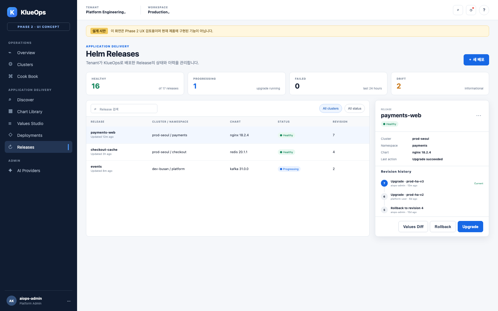

# Phase 2 Application Delivery UI/UX Screen Design

기준일: 2026-09-14  
상태: HTML 시안 완료, 구현 미착수

## 1. 시안 실행

[HTML 시안 열기](ui-mockups/index.html)

브라우저에서 직접 열면 좌측 `Applications` 하위 메뉴와 상단 화면 전환 control로 여섯 개 시안을 확인할 수 있다. Query parameter deep-link도 지원한다.

```text
ui-mockups/index.html?screen=discover
ui-mockups/index.html?screen=library
ui-mockups/index.html?screen=values
ui-mockups/index.html?screen=preview
ui-mockups/index.html?screen=releases
ui-mockups/index.html?screen=ai-settings
```

## 2. 공통 UX 원칙

- 기존 KlueOps sidebar, Tenant/Workspace selector, blue operator surface와 status pill을 유지한다.
- 복합 작업은 `Discover → Library → Values → Preview → Release` 단계로 나눈다.
- tab/filter/선택 screen은 URL에 보존해 deep-link가 가능해야 한다.
- 초보자에게 Chart, Values, Release의 의미와 다음 안전 행동을 짧게 설명한다.
- 위험 작업은 목록에서 즉시 실행하지 않고 설명 → preflight → exact confirmation → 결과 순으로 제공한다.
- 장시간 import/render/deploy는 기존 Job Center와 하단 Job Dock에 등록한다.
- AI 제안은 사용자 입력과 시각적으로 구분하고 근거, assumption과 적용 전 diff를 표시한다.
- Provider/model과 외부 전송 여부를 AI 실행 위치 가까이에 표시한다.

## 3. Navigation

```text
운영 관리
├─ Dashboard
├─ Triage
├─ Fleet Command
├─ Incidents
├─ Clusters
├─ Applications
│  ├─ Discover
│  ├─ Chart Library
│  └─ Releases
├─ Policies
└─ Audit

설정
├─ 사용자 설정
├─ Data & Runtime
├─ AI Provider
└─ 접근 관리
```

Feature가 비활성화되면 Applications 하위 메뉴 전체를 숨기고 직접 URL은 기능 비활성 Problem Detail 화면으로 연결한다.

## 4. 화면 목록

| ID | 화면 | 핵심 목표 |
| --- | --- | --- |
| AD-01 | Discover | Artifact Hub package 검색·비교·import |
| AD-02 | Chart Library | Tenant Chart/version/trust 상태 관리 |
| AD-03 | Values Studio | Form/YAML/AI로 Values Profile 작성 |
| AD-04 | Deployment Preview | manifest 위험·RBAC·변경사항 검토와 승인 |
| AD-05 | Releases | Cluster Helm Release 상태·history·rollback |
| AI-01 | AI Provider Settings | Local/외부 Provider profile과 Tenant routing 관리 |

## 5. AD-01 Discover


### 구성

- 검색어, category, official/verified, repository filter
- 결과 card의 publisher, version, license, update 시각과 security summary
- 우측 detail drawer에 README 요약, versions, default Values/Schema 제공 여부
- `Tenant Library에 가져오기` 전 source URL, exact version과 trust 상태 확인

### 상태

- Artifact Hub timeout: 기존 Library와 upload 동작 유지
- 검색 결과 없음: filter 초기화와 직접 repository/upload 안내
- deprecated Chart: 경고와 기본 import 차단
- security report Critical: 위험 설명과 관리자 정책에 따른 차단

## 6. AD-02 Chart Library


### 구성

- 현재 Tenant 소유 Chart만 표시
- source, version 수, trust, Values Profile, 최근 사용과 archive 상태
- `.tgz 업로드`, repository/OCI 가져오기, Artifact Hub로 이동
- 선택 Chart의 immutable versions, digest, provenance와 사용 중 Release 수

### 위험 UX

- 사용 중 version 삭제 금지
- archive는 신규 배포만 차단하고 기존 Release/rollback artifact를 유지
- repository credential 오류는 secret을 표시하지 않고 source health만 표시

## 7. AD-03 Values Studio


### 구성

- Chart/version과 Values Profile revision 고정 표시
- `Form`, `YAML`, `Diff` tab
- Schema Form의 설명, 기본값, validation과 Cluster capability hint
- 우측 AI Assistant의 자연어 입력, provider/model, 외부 전송 badge
- AI suggestion은 patch, assumptions, warnings와 `Diff 검토`만 제공

### 저장

- validation error가 있으면 revision 저장 차단
- Secret-like field는 masked input과 existing Secret reference 우선
- 저장 시 revision note와 변경 key 수 표시

## 8. AD-04 Deployment Preview


### 단계

1. 대상 확인
2. Chart/Values 고정
3. Render 및 정책 검사
4. Live diff
5. exact confirmation

### 중요 정보

- Cluster/Namespace/Release
- Chart digest와 Values revision
- Create/Update/Delete/Unchanged count
- CRD, cluster RBAC, hook, privileged, host access와 PVC 영향
- SSAR 결과와 partial/unknown source
- plan 만료 시간

위험이 없더라도 배포 버튼 옆에 실제 생성 resource 수와 rollback 정책을 표시한다.

## 9. AD-05 Releases



### 구성

- Tenant/Workspace/Cluster/Namespace filter
- release status, health, Chart/Values revision, 마지막 작업과 운영자
- detail에서 workload health, Helm history, Values diff와 Audit timeline
- `Upgrade 계획`, `Rollback 계획`, `Uninstall 계획`은 서로 다른 modal/workflow

Uninstall은 PVC와 external resource 보존 여부를 설명하고 exact phrase를 요구한다.

## 10. AI-01 AI Provider Settings


### Platform Admin

- Ollama/OpenAI/Google GenAI/OpenAI-compatible profile 등록
- endpoint/API key existing Secret, model과 timeout
- 연결 검사는 비민감 synthetic prompt만 사용
- external/local, validated/error와 최근 검사 시각 표시

### Tenant Admin

- Analysis/Chat/Helm Values별 허용 profile/model 선택
- 외부 데이터 전송 opt-in
- fallback 대상과 동작 확인
- Local → External 자동 fallback은 기본 off

Credential은 저장 후 재표시하지 않고 교체와 삭제만 제공한다.

## 11. 클릭·Popup·Confirmation 상세 명세

HTML 시안의 모든 `button`에는 동작이 연결되어 있다. 화면 이동은 URL query를 변경하고, 현재 화면 안의 선택은 active state, 짧은 완료 알림은 Toast, 추가 입력/검토가 필요한 작업은 Modal로 처리한다. Cluster나 외부 시스템을 변경하는 작업은 일반 Modal과 구분된 위험 확인 Modal을 사용한다.

### 11.1 공통 control

| Control | 클릭 결과 | 종료/후속 동작 |
| --- | --- | --- |
| 좌측 Phase 2 메뉴 | 해당 화면으로 이동하고 URL `screen` query 갱신 | Browser back/forward 복원 |
| Overview/Clusters/Cook Book | 1차 기능으로 이동한다는 안내 Modal | 시안에서는 현재 Phase 2 화면 유지 |
| 상단 검색 | 전체 검색 Modal과 검색어 입력 | 검색 실행 또는 취소 |
| Job Center | 실행/완료 작업 Modal | 전체 작업 보기로 Job Center 진입 |
| 도움말 `?` | 전체 배포 흐름 도움말 Modal | 닫기 |
| Modal `×`, 취소, backdrop, `Esc` | 변경 없이 닫기 | 원래 trigger로 focus 복원 |
| 성공한 단순 동작 | 우측 하단 Toast, 2.6초 후 자동 닫힘 | `aria-live=polite`로 결과 전달 |

### 11.2 Discover

| Control | Overlay/상태 | Confirm 이후 |
| --- | --- | --- |
| `소스 추가` | Helm Repository/OCI 선택, URL, credential 입력 Modal | 비민감 연결 검사 후 저장 단계 |
| `Artifact Hub 검색` | loading 후 결과 목록과 건수 갱신 | Toast로 검색 완료 |
| Helm/Verified/Official/Security filter | 같은 그룹의 active filter 변경 | URL filter query에 보존 예정 |
| 검색 결과 Card | 선택 border와 우측 detail 교체 | 별도 Confirm 없음 |
| `Tenant Library로 가져오기` | Chart/version/source/Tenant/digest 검토 Modal | `가져오기` 후 Job Center progress Modal |


Import는 Cluster 상태를 변경하지 않으므로 exact phrase까지 요구하지 않는다. 단, 취소와 가져오기 버튼을 분리하고 완료를 동기 성공처럼 표현하지 않고 Job으로 연결한다.

### 11.3 Chart Library

| Control | Overlay/상태 | Confirm 이후 |
| --- | --- | --- |
| `Repository` | Discover와 동일한 소스 추가 Modal | 연결 검사 후 저장 |
| `.tgz 업로드` | file drop Modal, 20 MiB 제한과 검사 항목 표시 | archive 검사 후 upload Job |
| All/Update/Needs review | table filter 변경 | 결과 건수 및 empty state 갱신 |
| Chart row | 선택 row와 하단 Chart detail 변경 | 별도 Confirm 없음 |
| version chip | 선택 version/digest/trust 정보 변경 | 사용 중 version 삭제 action은 비활성 |
| `Values 설정` | 선택 Chart/version을 고정하여 Values Studio 이동 | draft 복원 여부 확인 |

### 11.4 Values Studio

| Control | Overlay/상태 | Confirm 이후 |
| --- | --- | --- |
| Form/YAML/Diff | editor mode 변경 | 미저장 draft 유지 |
| 좌측 Values category | category active state와 field group 변경 | validation 상태 유지 |
| AI 전송 `↑` | 생성 중 상태, 중복 요청 방지 | Patch card 또는 masking된 오류 표시 |
| `검증 후 적용` | schema/type/unknown key 검증 결과 Toast | 유효한 patch만 Form draft에 반영 |
| `초기화` | 사라질 변경 수와 복귀 revision 경고 Modal | 위험 색상의 `변경 초기화` 후 Toast |
| `Values 저장` | profile 이름/revision note 입력 Modal | 새 immutable revision 저장 후 Toast |
| `배포 미리보기` | draft validation 후 Preview 이동 | validation 오류가 있으면 이동 차단 |

초기화는 Cluster 변경 작업은 아니므로 exact phrase를 요구하지 않지만 destructive color와 손실되는 변경 수를 표시한다.

### 11.5 Deployment Preview

| Control | Overlay/상태 | Confirm 이후 |
| --- | --- | --- |
| Target `변경` | Cluster/Namespace/Release 선택 Modal | Preview plan 재생성, 이전 plan 만료 |
| Deployment/Service/ConfigMap | 해당 resource diff active tab 변경 | URL resource query 보존 |
| `전체 렌더링 YAML 보기` | Secret을 masking한 read-only YAML Modal | 복사 또는 닫기 |
| `이전` | Values Studio 이동 | 기존 Preview plan 유지 |
| `확정 단계로` | 대상, resource 영향, rollback 정책과 만료시간을 표시하는 위험 Modal | exact phrase 일치 시에만 실행 가능 |


배포 Confirm 규칙:

1. 대상 Cluster/Namespace/Release를 다시 표시한다.
2. Create/Update/Delete 수와 경고를 요약한다.
3. 사용자가 Release 이름 `payments-web`을 정확히 입력해야 버튼이 활성화된다.
4. Confirm 시점에 plan expiry와 권한을 서버에서 재검사한다.
5. 요청은 idempotency key로 한 번만 수락하고 Job Center에 등록한다.
6. 완료 Modal은 성공/실패/부분 실패와 다음 안전 행동을 제공한다.

### 11.6 Releases

| Control | Overlay/상태 | Confirm 이후 |
| --- | --- | --- |
| `새 배포` | Discover로 이동 | 새 workflow 시작 |
| Cluster/Status filter | release table filter | URL query 보존 |
| Release row | 우측 detail/history 교체 | 별도 Confirm 없음 |
| `…` | 상세/Audit/Uninstall 계획 action menu | Uninstall은 별도 exact confirmation 필요 |
| `Values Diff` | revision 간 Values diff Modal | read-only, 복사 가능 |
| `Rollback` | target revision과 영향이 표시된 위험 Modal | Release 이름 exact match 후 rollback Job |
| `Upgrade` | 현재 Chart/Values를 고정해 Values Studio 이동 | Preview를 다시 통과해야 실행 가능 |


Uninstall은 Pod뿐 아니라 PVC, hook과 external resource 보존 여부를 계획 화면에서 먼저 보여주고 `release/namespace` exact phrase를 요구한다. 목록의 action menu에서 즉시 삭제하지 않는다.

### 11.7 AI Provider Settings

| Control | Overlay/상태 | Confirm 이후 |
| --- | --- | --- |
| `Provider Profile` | Provider→Credential→Model→Tenant 4단계 Modal | synthetic prompt 연결 검사 후 저장 |
| `정책 보기` | 외부 전송 포함/제외 데이터와 Audit 정책 Modal | 읽음 확인 |
| Provider `설정` | 선택 Provider가 채워진 설정 Modal | credential 교체 또는 연결 검사 |
| Provider `…` | 연결 검사/편집/비활성/삭제 action menu | 사용 중 profile 삭제는 차단 |
| Routing profile/model selector | 허용된 profile과 9B 이하 local model selector | 미저장 상태 표시 |
| External Transfer switch | 데이터 반출 경고 및 정책 동의 Modal | Tenant/purpose별 명시 동의 후만 ON |
| `변경 저장` | 세 purpose의 before/after와 External 상태 검토 Modal | 새 요청부터 적용, 실행 중 Job 불변 |


### 11.8 Modal 상태와 오류

| 상태 | 표시 원칙 |
| --- | --- |
| Opening | 첫 입력 field로 focus 이동, background scroll 차단 |
| Validation | field 바로 아래 원인과 해결 방법 표시, Confirm 비활성 |
| Submitting | Confirm spinner와 중복 클릭 차단, 취소는 request 접수 전만 허용 |
| Accepted | Modal을 Job progress로 전환하고 job ID 표시 |
| Failed before accept | 입력 유지, masking된 오류와 재시도 제공 |
| Failed after accept | Job Center에서 실패 단계, rollback/cleanup과 Audit link 제공 |
| Expired plan | 실행 차단, Preview 재생성만 제공 |
| Permission changed | 실행 차단, 필요한 권한과 Cluster 관리자 문의 안내 |

## 12. Responsive

- 1280px 이상: sidebar + main + detail/assistant 3-column
- 900~1279px: sidebar + main, detail drawer overlay
- 899px 이하: sidebar 접힘, step별 단일 column
- Values Editor와 Preview table은 horizontal scroll보다 field/card 재배치를 우선한다.
- 위험 confirmation은 mobile에서도 viewport 아래로 숨지 않게 sticky action bar를 사용한다.

## 13. 접근성

- status를 색만으로 구분하지 않고 icon/text를 함께 제공한다.
- tab, drawer, modal과 stepper에 keyboard focus 순서와 ARIA 상태를 제공한다.
- AI streaming과 Job progress는 과도한 live announcement를 피하고 완료/실패만 polite region으로 알린다.
- YAML validation은 line/column과 해결 방법을 text로 제공한다.
- 위험 action은 icon-only button으로 제공하지 않는다.
- Modal은 `role=dialog`, `aria-modal`, label을 제공하며 focus trap과 trigger focus 복원을 구현한다.
- exact confirmation은 paste를 막지 않으며 대소문자/공백 불일치를 field 오류 text로 설명한다.

## 14. Frontend 구현 경계

- route: `/applications/discover`, `/applications/library`, `/applications/releases`
- Values Studio: `/applications/charts/:chartId/versions/:versionId/values/:profileId`
- Preview: `/applications/deployment-plans/:planId`
- AI Settings: `/settings/ai-providers`
- catalog/import/deploy API client는 `frontend/src/api`에 둔다.
- long-running job은 `jobCenter` store에 등록한다.
- cross-screen filter는 전용 Pinia store보다 URL query를 우선한다.
- page component는 조합만 담당하고 catalog card, Values editor, AI suggestion, policy result와 release history를 component로 분리한다.
- CSS는 `frontend/src/styles/components/application-delivery.css` 한 ownership 파일에서 시작한다.
