# Phase 2 Application Delivery UI/UX Screen Design

기준일: 2026-09-15

상태: HTML 시안 완료, 구현 미착수

시안 회귀 확인은 mockup 디렉터리를 정적 서버로 연 뒤 `node smoke-test.mjs`와 `node capture-screenshots.mjs`로 재현한다. `CHROME_PATH`는 system Chrome을 사용할 때만 지정하며, 생략하면 Playwright bundled Chromium을 사용한다.

## Phase 2 최우선 선행 작업: P2-0 기존 제품 UI 현대화

Application Delivery 화면을 구현하기 전에 현재 KlueOps 전체 화면을 이 HTML 시안의 완성도와 visual language로 현대화한다. 현재 UI의 프로토타입 인상을 만드는 화면별 spacing·typography 불일치, 단순 raw control, 약한 정보 위계, 밀집된 운영 정보와 일관되지 않은 feedback을 먼저 해소한다.

이 시안은 신규 Applications 화면에만 적용하는 별도 theme가 아니라 전체 제품의 target design이다. 기존 Login, Overview, Cluster/Console, Analysis/Chat, Operations/Incident/Runbook, Policy/Audit와 Settings도 같은 shell, token, component와 interaction 원칙을 사용해야 한다.

Tenant별 메뉴는 선택한 Tenant/Workspace의 effective capability와 Tenant feature policy를 함께 적용한다. Platform Manager는 모든 Tenant와 메뉴를 사용한다. Tenant Admin은 해당 Tenant의 구성원·기능·공유 Chart·AI routing, Cluster Admin은 허용 Cluster의 설정과 Application 수명주기, Operator는 허용 Cluster/Namespace의 분석·배포·Rollback, Viewer는 read-only 메뉴만 사용한다. 메뉴 숨김은 API 보안을 대신하지 않는다.

### P2-0 화면 적용 순서

1. design token, typography, icon과 global shell/sidebar/header
2. button/form/table/card/status/modal/drawer/toast와 loading/empty/error 공통 상태
3. Login, Overview, Clusters/Detail/Console 핵심 진입 흐름
4. Analysis/Chat과 운영·Incident·Runbook 화면
5. Policy/Audit/Access/AI/Runtime Settings
6. visual/functional regression 승인 후 Application Delivery 화면 구현

### P2-0 UX 승인 기준

- 아래 HTML 시안과 동등한 시각적 완성도, 정보 위계와 여백을 제공한다.
- 화면 크기와 데이터 양이 달라도 잘림, 겹침, 과도한 horizontal scroll이 없어야 한다.
- 초보 운영자는 상태 의미와 다음 행동을 이해할 수 있고 전문가는 세부 evidence로 이동할 수 있어야 한다.
- mutation, read-only 점검과 위험 confirmation이 시각적으로 명확히 구분돼야 한다.
- 공통 component로 일관성을 확보하며 화면마다 시안 CSS를 복제하지 않는다.
- 기존 사용자 흐름, route, 권한과 API 결과는 UI 변경 전후 동일하게 동작해야 한다.
- 대표 route와 loading/empty/error/permission-denied/modal 상태의 기준 screenshot을 승인하고 visual regression에 보관한다.

## 1. 시안 실행

[HTML 시안 열기](ui-mockups/index.html)

브라우저에서 직접 열면 좌측 `Applications`, `Users & Access`, `AI Providers` 메뉴와 workflow 버튼을 통해 전체 시안을 확인할 수 있다. Query parameter deep-link도 지원한다.

```text
ui-mockups/index.html?screen=discover
ui-mockups/index.html?screen=library
ui-mockups/index.html?screen=sources
ui-mockups/index.html?screen=values
ui-mockups/index.html?screen=exposure
ui-mockups/index.html?screen=preview
ui-mockups/index.html?screen=applications
ui-mockups/index.html?screen=application-detail
ui-mockups/index.html?screen=ai-settings
ui-mockups/index.html?screen=models
```

## 2. 공통 UX 원칙

- 기존 KlueOps sidebar, Tenant/Workspace selector, blue operator surface와 status pill을 유지한다.
- 복합 작업은 `Discover → Library → Values → Target/Exposure → Preview → Application` 단계로 나눈다.
- tab/filter/선택 screen은 URL에 보존해 deep-link가 가능해야 한다.
- 초보자에게 Chart, Values, Release의 의미와 다음 안전 행동을 짧게 설명한다.
- 위험 작업은 목록에서 즉시 실행하지 않고 설명 → preflight → exact confirmation → 결과 순으로 제공한다.
- 장시간 import/render/deploy는 기존 Job Center와 하단 Job Dock에 등록한다.
- AI 제안은 사용자 입력과 시각적으로 구분하고 근거, assumption과 적용 전 diff를 표시한다.
- Provider/model과 외부 전송 여부를 AI 실행 위치 가까이에 표시한다.

`Deployments`는 좌측 상시 메뉴로 두지 않는다. Applications의 `Application 배포` chooser에서 보유 Library Chart(권장), 새 Chart 검색, URL/.tgz 직접 가져오기 중 시작점을 선택하고 Chart 확정 후 Values Studio부터 Wizard를 진행한다. 실행 중 progress는 어느 화면에서나 여는 Job Center/Job Dock, 대상별 운영은 Deployed Applications와 Application Detail이 담당한다.

## 3. Navigation

```text
운영 관리
├─ Dashboard
├─ Triage
├─ Fleet Command
├─ Incidents
├─ Clusters
├─ Applications
│  ├─ Discover
│  ├─ Chart Library
│  │  └─ Sources
│  └─ Deployed Applications
├─ Policies
└─ Audit

설정
├─ 사용자 설정
├─ Data & Runtime
├─ AI Provider
│  └─ Local Models
└─ 접근 관리
```

Feature가 비활성화되면 Applications 하위 메뉴 전체를 숨기고 직접 URL은 기능 비활성 Problem Detail 화면으로 연결한다.

Job Center는 Applications 하위 route가 아니라 기존 전역 header에서 여는 overlay panel이다. Install/Upgrade/Rollback/Uninstall 외에도 Chart import와 Local Model download를 함께 보여주며 각 항목에서 관련 Application, Chart 또는 Provider로 이동한다.

## 4. 화면 목록

| ID | 화면 | 핵심 목표 |
| --- | --- | --- |
| AD-01 | Discover | Artifact Hub package 검색·비교·import |
| AD-02 | Chart Library | Tenant Chart/version/trust 상태 관리 |
| AD-03 | Sources | 재사용 Helm Repository/OCI 연결과 credential/sync 관리 |
| AD-04 | Values Studio | Form/YAML/AI로 Values Profile 작성 |
| AD-05 | Target & Exposure | Cluster/Namespace와 Internal/Route/Domain 선택 |
| AD-06 | Deployment Preview | Helm/companion manifest 위험·RBAC/Gateway 검토와 승인 |
| AD-07 | Deployed Applications | KlueOps 관리 Application 목록과 상태 |
| AD-08 | Application Detail | Workload/Pod/Endpoint/Configuration/History/Uninstall |
| AI-01 | AI Provider Settings | Local/외부 Provider profile과 Tenant routing 관리 |
| AI-02 | Local Models | 9B 이하 Ollama model download/검증/승인/삭제 보호 |
| IAM-01 | Users & Access | Tenant 구성원 초대·상태·역할/scope와 메뉴 접근 Preview |

### 4.1 Deployment 기능 배치

| 사용자가 찾는 것 | 제공 위치 | 표시 범위 |
| --- | --- | --- |
| 새 Helm 배포 설정 | Values Studio → Target & Exposure → Deployment Preview | 실행 전 만료형 Wizard |
| 실행 중 배포와 진행률 | 전역 Job Center와 하단 Job Dock | 현재 사용자 권한 범위의 async Job |
| 배포 중·완료·실패 Application | Deployed Applications | `DEPLOYING`부터 `FAILED`까지 |
| 특정 Application의 작업 이력 | Application Detail → History | Install/Upgrade/Rollback/Uninstall과 Audit |
| Kubernetes `Deployment` resource | Application Detail → Workloads | Ready, Pod, restart, Event와 Console link |

따라서 Deployment 기능이 사라진 것이 아니라 실행 전·실행 중·실행 후 책임으로 분리됐다. 독립 `Deployments` 메뉴와 별도 `Operations` 화면은 만들지 않는다.

## 5. AD-01 Discover

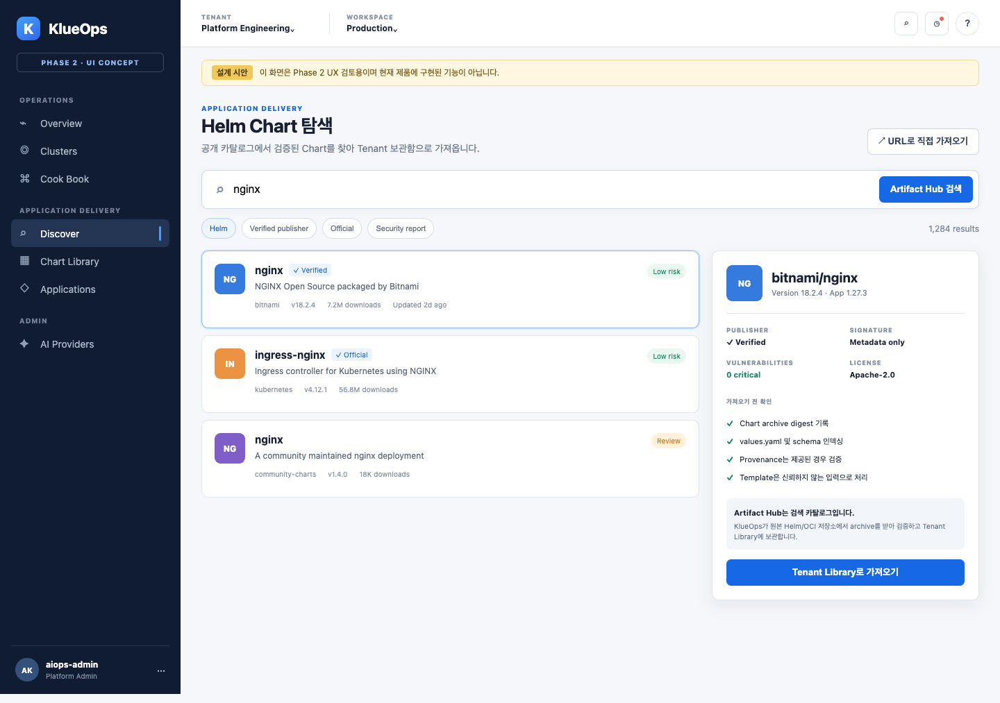

### 구성

- 검색어, category, official/verified, repository filter
- 결과 card의 publisher, version, license, update 시각과 security summary
- 우측 detail drawer에 README 요약, versions, default Values/Schema 제공 여부
- `Tenant Library에 가져오기` 전 source URL, exact version과 trust 상태 확인
- `URL로 직접 가져오기`는 Chart 한 건을 import하며 선택해야만 영구 Source로 저장

### 상태

- Artifact Hub timeout: 기존 Library와 upload 동작 유지
- 검색 결과 없음: filter 초기화와 직접 repository/upload 안내
- deprecated Chart: 경고와 기본 import 차단
- security report Critical: 위험 설명과 관리자 정책에 따른 차단

## 6. AD-02 Chart Library

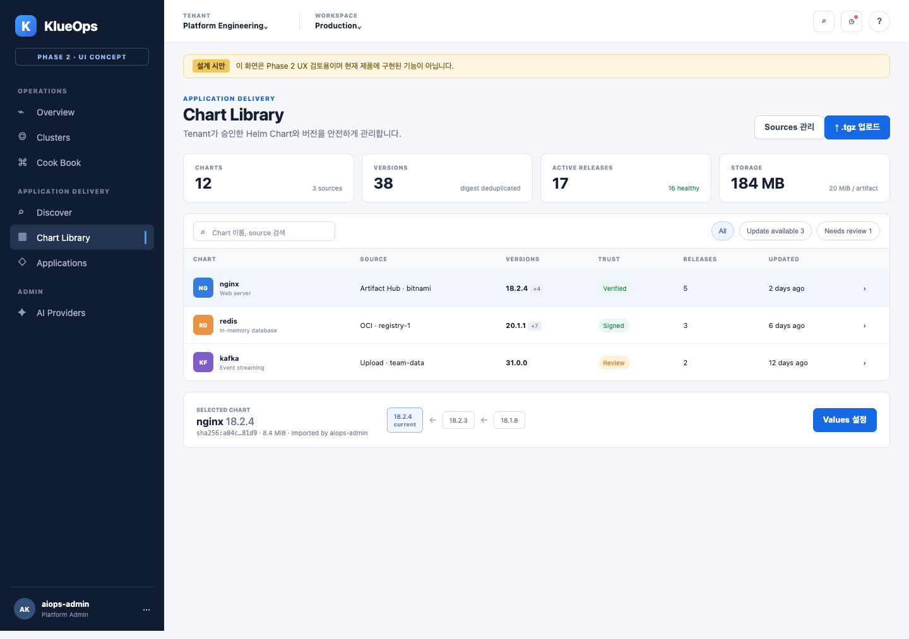

### 구성

- 현재 Tenant 소유 Chart만 표시
- source, version 수, trust, Values Profile, 최근 사용과 archive 상태
- `.tgz 업로드`, Sources 관리, Artifact Hub로 이동
- 선택 Chart의 immutable versions, digest, provenance와 사용 중 Release 수

### 위험 UX

- 사용 중 version 삭제 금지
- archive는 신규 배포만 차단하고 기존 Release/rollback artifact를 유지
- repository credential 오류는 secret을 표시하지 않고 source health만 표시

## 7. AD-03 Sources

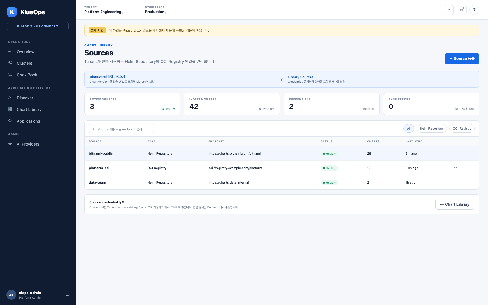

- Discover 직접 가져오기와 구분되는 재사용 연결 관리 화면
- Helm Repository/OCI Registry endpoint, credential reference, health와 마지막 sync
- indexed Chart 수, sync 오류와 수동 연결 검사
- Source 삭제 전 연결된 Chart가 immutable cache에 보존됐는지 확인
- Credential은 저장 후 재표시하지 않고 교체만 제공

## 8. AD-04 Values Studio

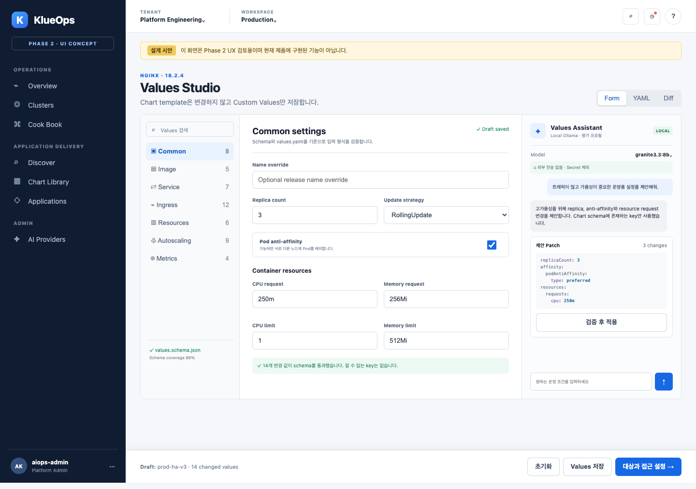

### 구성

- Chart/version과 Values Profile revision 고정 표시
- `Form`, `YAML`, `Diff` tab
- Schema Form의 설명, 기본값, validation과 Cluster capability hint
- 우측 AI Assistant의 자연어 입력, provider/model, 외부 전송 badge
- AI suggestion은 patch, assumptions, warnings와 `Diff 검토`만 제공

### 저장

- validation error가 있으면 revision 저장 차단
- Secret-like field는 masked input과 existing Secret reference 우선
- 저장 시 revision note와 변경 key 수 표시

## 9. AD-05 Target & Exposure

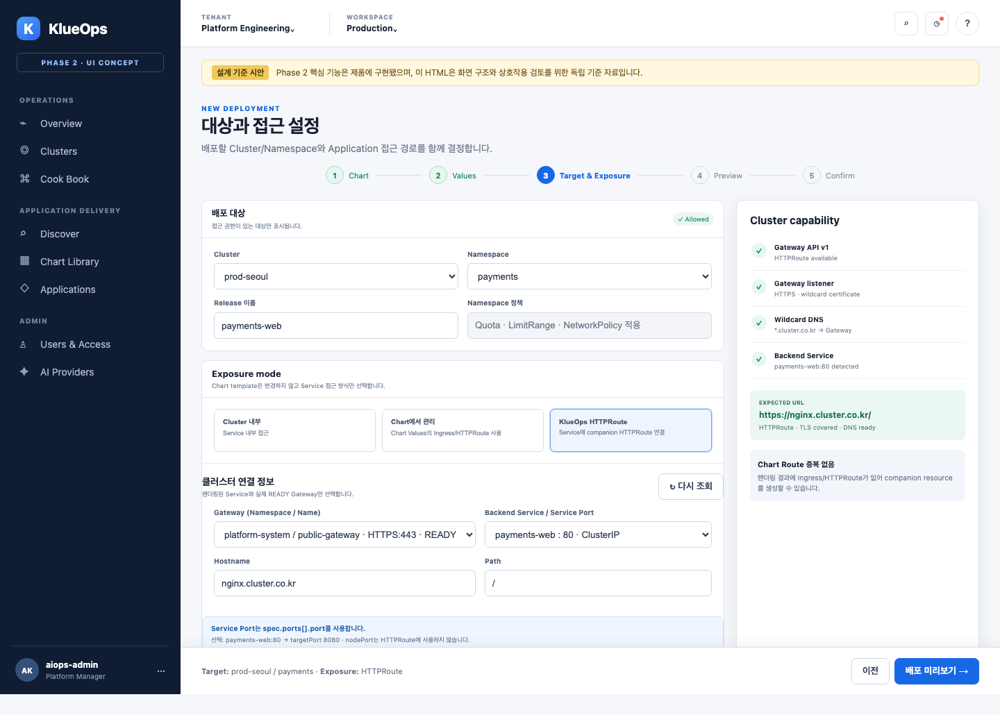

### Target

- 접근 가능한 Cluster와 기존 Namespace만 기본 표시
- `namespace:create`와 Cluster 정책이 허용할 때만 새 Namespace 계획 제공
- Release 이름은 Cluster/Namespace 범위에서 중복 검사
- Namespace 생성 plan에 Quota, LimitRange, NetworkPolicy를 함께 표시

### Exposure

- `Internal only`: ClusterIP Service만 사용
- `Chart-managed`: Chart Values가 만드는 Ingress/HTTPRoute 사용
- `KlueOps-managed`: 렌더링된 Service/Port에 companion HTTPRoute/Ingress 연결
- Gateway/Listener, hostname, path, backend Service/Port, TLS와 DNS mode 입력
- wildcard DNS/Gateway certificate 재사용 여부와 예상 URL 표시
- Gateway API가 없거나 Chart Route와 중복되면 안전한 대안과 차단 사유 표시

## 10. AD-06 Deployment Preview

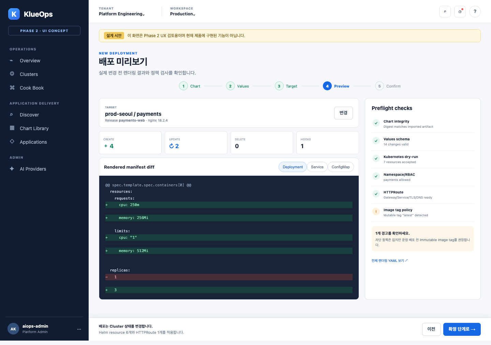

### 단계

1. 대상 확인
2. Chart/Values 고정
3. Target/Exposure 고정
4. Render 및 정책 검사
5. Helm/companion live diff
6. exact confirmation

### 중요 정보

- Cluster/Namespace/Release
- Exposure mode, hostname, Gateway/Listener, backend Service/Port
- Chart digest와 Values revision
- Create/Update/Delete/Unchanged count
- CRD, cluster RBAC, hook, privileged, host access와 PVC 영향
- SSAR 결과와 partial/unknown source
- plan 만료 시간

위험이 없더라도 배포 버튼 옆에 실제 생성 resource 수와 rollback 정책을 표시한다.

## 11. AD-07 Deployed Applications

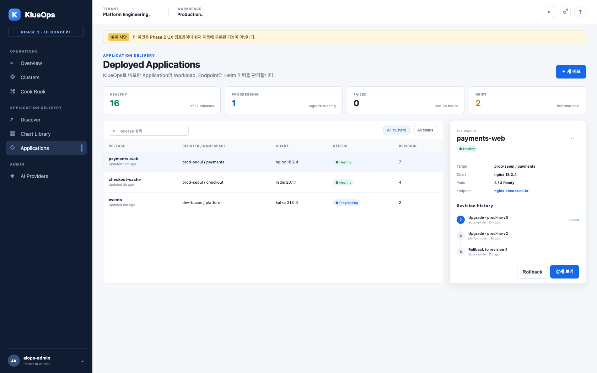

### 구성

- 상단 lifecycle map으로 `배포 Wizard → Job Center → Deployed Applications → Application Detail`의 책임을 항상 표시
- Tenant/Workspace/Cluster/Namespace filter
- Application status, Pod/Endpoint health, Chart/Values revision, 마지막 작업과 운영자
- install 요청이 수락된 즉시 `DEPLOYING` row를 만들고 진행률/Job Center link를 표시
- 실패한 최초 install도 `FAILED` row로 유지해 실패 단계, retry와 cleanup에 접근 가능
- detail에서 workload health, Helm history, Values diff와 Audit timeline
- `Upgrade 계획`, `Rollback 계획`, `Uninstall 계획`은 서로 다른 modal/workflow

목록에는 KlueOps가 배포한 Application만 표시하며 기존 Cluster workload 자동 발견·편입은 하지 않는다.

## 12. AD-08 Application Detail

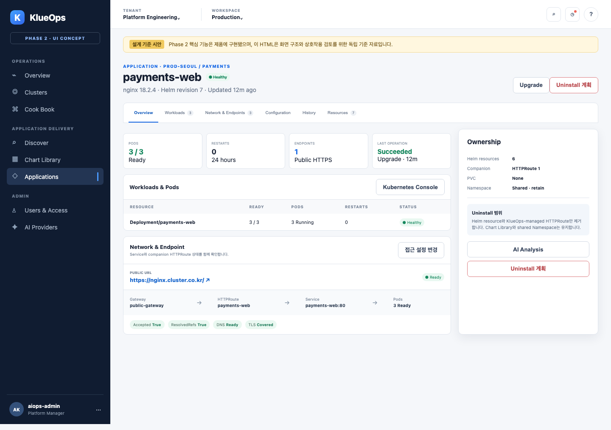

- Overview: Cluster/Namespace, Chart/Values, current Helm revision
- Workloads: Deployment/StatefulSet, Pod Ready/restart/Event와 Console 이동
- Network & Endpoints: Service → HTTPRoute/Ingress → Gateway → URL 연결 관계
- Endpoint 상태: Accepted, ResolvedRefs, DNS와 TLS를 독립 표시
- Configuration: 적용 Values, redacted diff와 Secret reference
- History: install/upgrade/rollback/uninstall operation과 Audit
- Resources: Helm resource와 KlueOps companion resource의 ownership 구분
- Uninstall 계획: Helm/companion/PVC/DNS/TLS/Namespace/Library의 삭제·보존 범위 확인

Application uninstall은 Chart Library artifact와 공유 Namespace를 삭제하지 않는다. PVC, DNS와 TLS는 plan에서 명시한 보존 정책만 적용하며 exact confirmation을 요구한다.

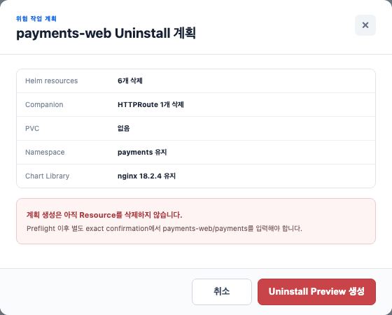

## 13. AI-01 AI Provider Settings

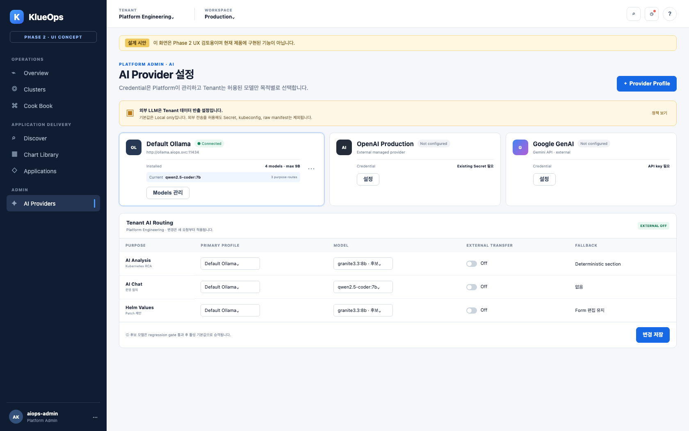

### Platform Manager

- Ollama/OpenAI/Google GenAI/OpenAI-compatible profile 등록
- endpoint/API key existing Secret, model과 timeout
- 연결 검사는 비민감 synthetic prompt만 사용
- external/local, validated/error와 최근 검사 시각 표시

### Tenant Admin

- Analysis/Chat/Helm Values별 허용 profile/model 선택
- 외부 데이터 전송 opt-in
- fallback 대상과 동작 확인
- Local → External 자동 fallback은 기본 off

Credential은 저장 후 재표시하지 않고 교체와 삭제만 제공한다.

## 14. AI-02 Local Models

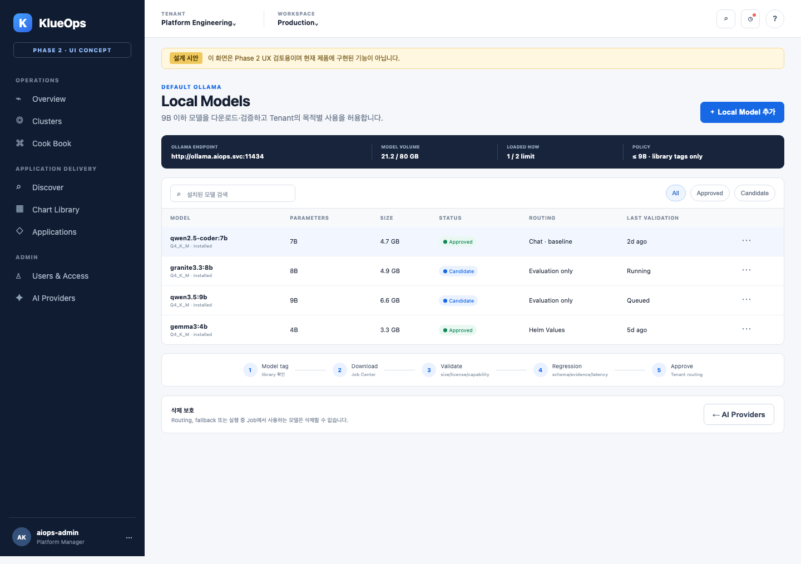

- `GET /api/tags` 기반 설치 model/digest/parameter/quantization 표시
- library model tag 입력, 9B 이하 검사와 예상 download/volume 표시
- Download는 Job Center에서 진행하고 capability/license 검증 후 Candidate로 등록
- regression gate를 통과한 Approved model만 Tenant routing에 노출
- Routing/fallback/실행 중 Job이 참조하는 model 삭제 차단
- loaded model 수, keep-alive, volume과 queue budget 표시

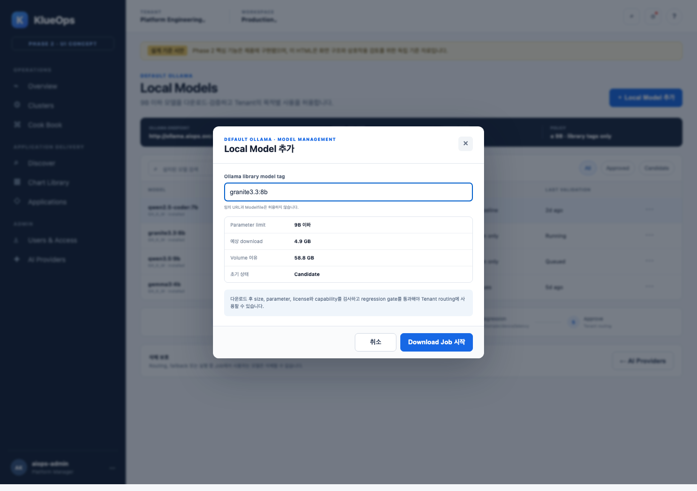

## 14.1 IAM-01 Users & Access

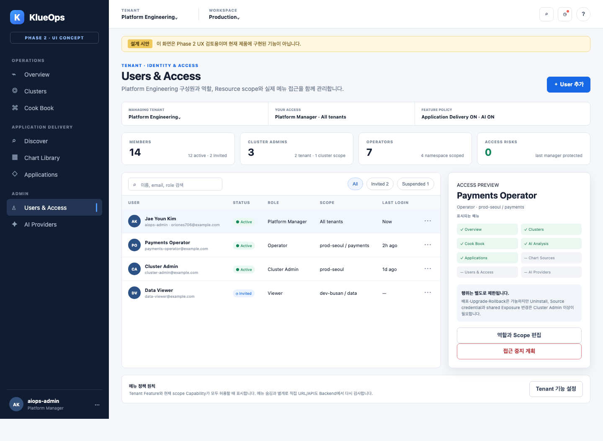

- 선택 Tenant의 구성원 상태, 역할과 Tenant/Workspace/Cluster/Namespace scope를 한 목록에서 확인한다.
- 선택 사용자의 “표시되는 메뉴”와 제한되는 위험 행위를 Access Preview로 설명한다.
- Platform Manager는 모든 Tenant를 선택하고 모든 기능을 관리한다.
- Tenant Admin은 해당 Tenant의 초대, suspend/offboard와 RoleBinding을 관리하지만 Platform 설정은 볼 수 없다.
- 메뉴는 Tenant Feature와 현재 scope effective capability의 교집합이며 직접 URL/API도 같은 정책을 검사한다.
- OIDC Group Mapping은 `issuer + group → Tenant + Role + Scope`를 명시적으로 연결하며 Group 이름만으로 전역 권한을 추측하지 않는다.

상단 Tenant selector는 Platform Manager에게 전체 Tenant를, Tenant 역할 사용자에게 membership이 있는 Tenant만 표시한다. Tenant 변경 시 구성원 목록, Access Preview, Feature와 좌측 메뉴를 한 access revision으로 다시 불러오며 이전 Tenant 데이터는 즉시 비운다.

| 역할 | Users & Access에서 가능한 동작 | 숨김/차단 동작 |
| --- | --- | --- |
| Platform Manager | 모든 Tenant 구성원·Group Mapping·기능 정책, Platform Manager 관리 | 원격 Cluster RBAC가 거부한 작업 |
| Tenant Admin | 현재 Tenant 초대, Role/Scope 변경, 접근 중지·탈퇴, Group Mapping, Tenant Feature | Platform Manager 부여/회수, 다른 Tenant, Platform Provider/Model |
| Cluster Admin | 자기 접근 정보와 허용 Cluster 구성원 조회 | User/Group/Feature mutation |
| Operator/Viewer | 자기 역할·scope·표시 메뉴 확인 | 다른 User와 정책 관리 |

Company AA 예시에서는 `/companies/aa/cluster-admins`의 u1을 `AA / Cluster Admin / Tenant 또는 지정 Cluster`, `/companies/aa/operators`의 u2·u3를 `AA / Operator / Tenant 또는 지정 Namespace`로 Mapping한다. Group 문자열은 자유 입력이지만 issuer와 실제 claim sample을 검증하고, Tenant-qualified Group path를 권장한다.

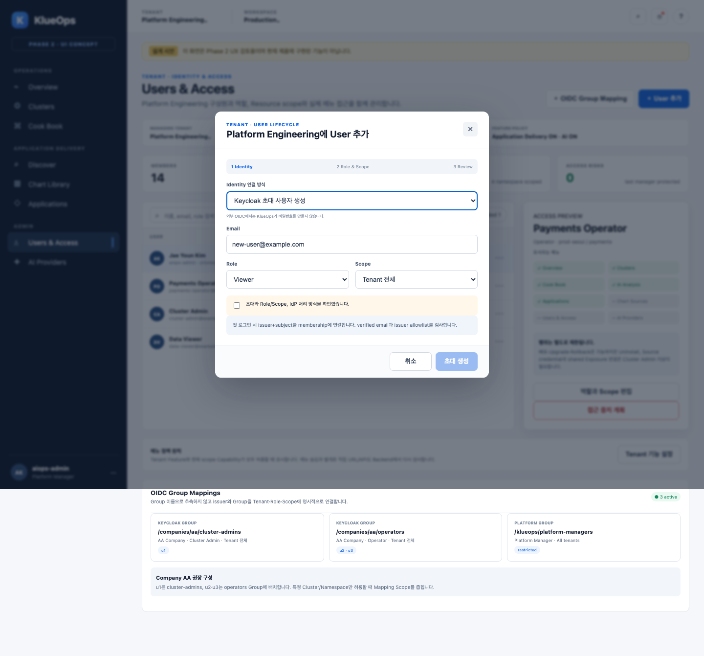

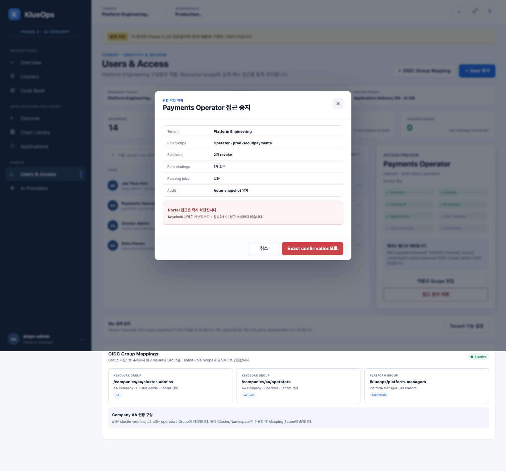

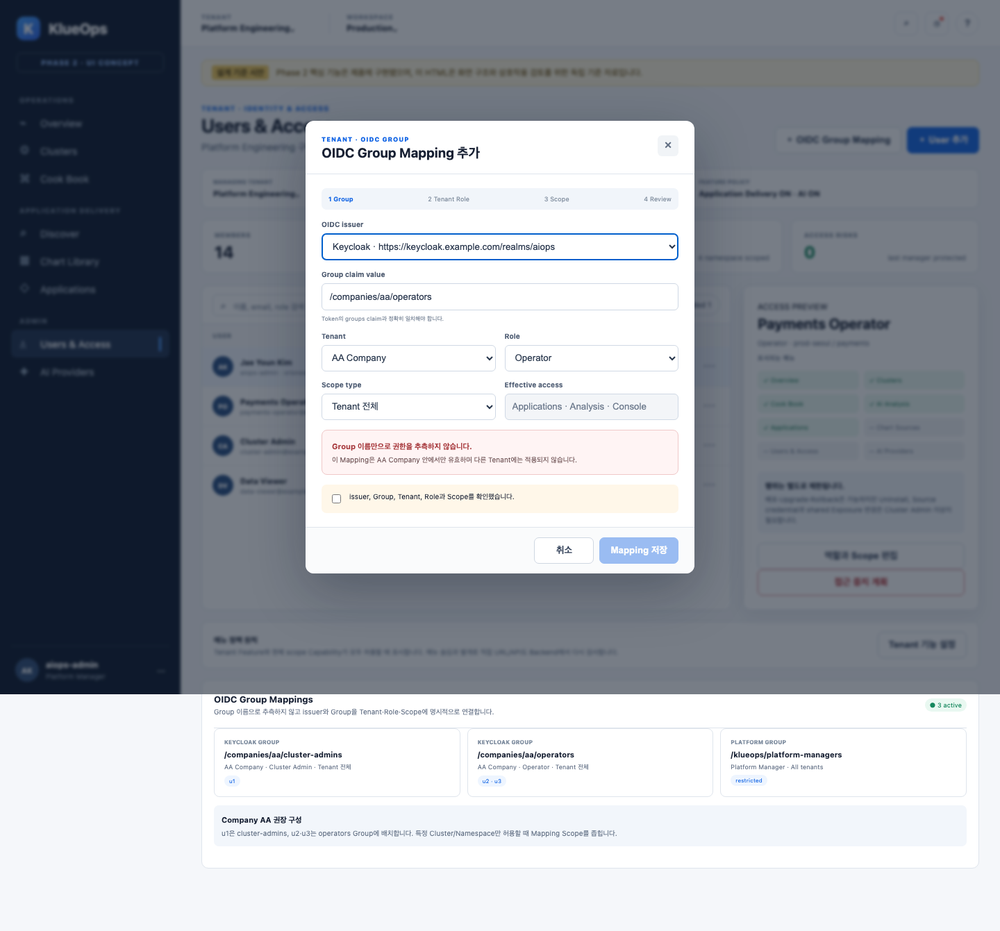

외부 OIDC에서는 KlueOps가 비밀번호 사용자를 생성하지 않고 pending membership만 만든다. Keycloak 관리 연동에서만 IdP 사용자 생성과 required action을 지원한다. `삭제`는 기본적으로 suspend/offboard이며 Audit actor snapshot을 보존한다.

## 15. 클릭·Popup·Confirmation 상세 명세

HTML 시안의 모든 `button`에는 동작이 연결되어 있다. 화면 이동은 URL query를 변경하고, 현재 화면 안의 선택은 active state, 짧은 완료 알림은 Toast, 추가 입력/검토가 필요한 작업은 Modal로 처리한다. Cluster나 외부 시스템을 변경하는 작업은 일반 Modal과 구분된 위험 확인 Modal을 사용한다.

### 15.1 공통 control

| Control | 클릭 결과 | 종료/후속 동작 |
| --- | --- | --- |
| 좌측 Phase 2 메뉴 | 해당 화면으로 이동하고 URL `screen` query 갱신 | Browser back/forward 복원 |
| Overview/Clusters/Cook Book | 1차 기능으로 이동한다는 안내 Modal | 시안에서는 현재 Phase 2 화면 유지 |
| 상단 검색 | 전체 검색 Modal과 검색어 입력 | 검색 실행 또는 취소 |
| Job Center | 전역 Overlay; 유형, 대상, progress, 실패 단계와 최근 결과 표시 | 항목 클릭 시 관련 Application/Chart/Provider로 이동 |
| 도움말 `?` | 전체 배포 흐름 도움말 Modal | 닫기 |
| Modal `×`, 취소, backdrop, `Esc` | 변경 없이 닫기 | 원래 trigger로 focus 복원 |
| 성공한 단순 동작 | 우측 하단 Toast, 2.6초 후 자동 닫힘 | `aria-live=polite`로 결과 전달 |

### 15.2 Discover

| Control | Overlay/상태 | Confirm 이후 |
| --- | --- | --- |
| `URL로 직접 가져오기` | Source type, exact Chart/version과 선택형 `Source 저장` Modal | 한 건 검사 후 Tenant Library import |
| `Artifact Hub 검색` | loading 후 결과 목록과 건수 갱신 | Toast로 검색 완료 |
| Helm/Verified/Official/Security filter | 같은 그룹의 active filter 변경 | URL filter query에 보존 예정 |
| 검색 결과 Card | 선택 border와 우측 detail 교체 | 별도 Confirm 없음 |
| `Tenant Library로 가져오기` | Chart/version/source/Tenant/digest 검토 Modal | `가져오기` 후 Job Center progress Modal |

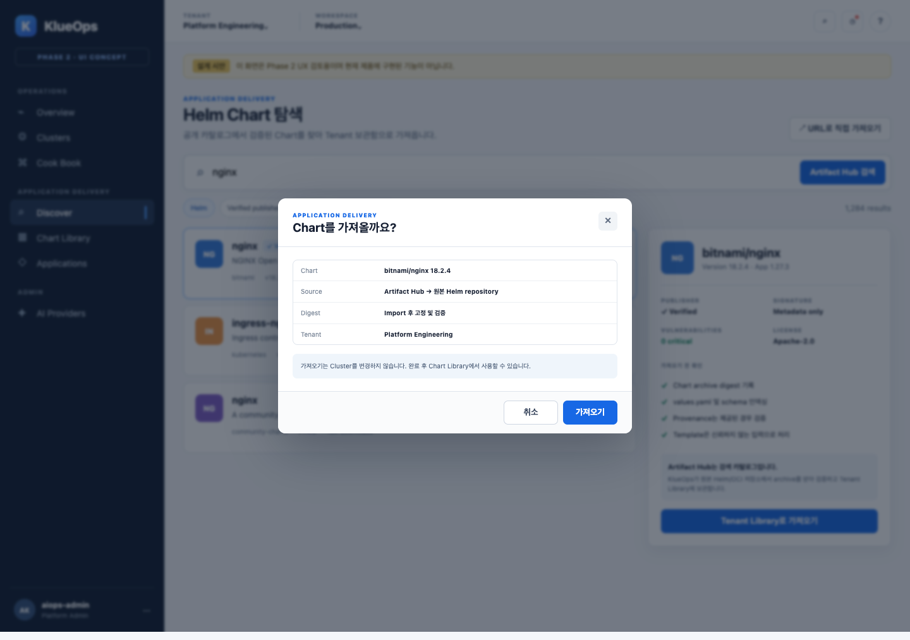

Import는 Cluster 상태를 변경하지 않으므로 exact phrase까지 요구하지 않는다. 단, 취소와 가져오기 버튼을 분리하고 완료를 동기 성공처럼 표현하지 않고 Job으로 연결한다.

### 15.3 Chart Library

| Control | Overlay/상태 | Confirm 이후 |
| --- | --- | --- |
| `Sources 관리` | 영구 Helm Repository/OCI 연결 관리 화면 이동 | Source health/sync/credential 관리 |
| `.tgz 업로드` | file drop Modal, 20 MiB 제한과 검사 항목 표시 | archive 검사 후 upload Job |
| All/Update/Needs review | table filter 변경 | 결과 건수 및 empty state 갱신 |
| Chart row | 선택 row와 하단 Chart detail 변경 | 별도 Confirm 없음 |
| version chip | 선택 version/digest/trust 정보 변경 | 사용 중 version 삭제 action은 비활성 |
| `Values 설정` | 선택 Chart/version을 고정하여 Values Studio 이동 | draft 복원 여부 확인 |

### 15.4 Sources

| Control | Overlay/상태 | Confirm 이후 |
| --- | --- | --- |
| `Source 등록` | Helm Repository/OCI, endpoint, existing Secret Modal | 연결 검사 후 Tenant Source 저장 |
| Source type filter | 목록과 건수 갱신 | URL query 보존 |
| Source `…` | 지금 동기화/연결 검사/Credential 교체/비활성화 menu | 장시간 sync는 Job Center 등록 |
| `Chart Library` | Chart 목록 복귀 | Source filter를 referrer query로 유지 |

### 15.5 Values Studio

| Control | Overlay/상태 | Confirm 이후 |
| --- | --- | --- |
| Form/YAML/Diff | editor mode 변경 | 미저장 draft 유지 |
| 좌측 Values category | category active state와 field group 변경 | validation 상태 유지 |
| AI 전송 `↑` | 생성 중 상태, 중복 요청 방지 | Patch card 또는 masking된 오류 표시 |
| `검증 후 적용` | schema/type/unknown key 검증 결과 Toast | 유효한 patch만 Form draft에 반영 |
| `초기화` | 사라질 변경 수와 복귀 revision 경고 Modal | 위험 색상의 `변경 초기화` 후 Toast |
| `Values 저장` | profile 이름/revision note 입력 Modal | 새 immutable revision 저장 후 Toast |
| `대상과 접근 설정` | draft validation 후 Target/Exposure 이동 | validation 오류가 있으면 이동 차단 |

초기화는 Cluster 변경 작업은 아니므로 exact phrase를 요구하지 않지만 destructive color와 손실되는 변경 수를 표시한다.

### 15.6 Target & Exposure

| Control | Overlay/상태 | Confirm 이후 |
| --- | --- | --- |
| Cluster/Namespace | 권한 있는 대상 선택, 새 Namespace는 별도 plan | capability/Quota/NetworkPolicy 재검사 |
| Exposure mode | Internal/Chart-managed/KlueOps-managed 단일 선택 | 입력 field와 capability 결과 갱신 |
| Gateway/Listener | allowedRoutes를 통과한 Gateway만 선택 | HTTPRoute preflight 갱신 |
| Hostname/Path | DNS/TLS coverage와 충돌 검사 | 예상 URL 표시 |
| Backend Service/Port | render 결과의 Service만 선택 | ResolvedRefs 사전 검사 |
| `배포 미리보기` | Target/Exposure plan 저장 후 Preview 이동 | plan 만료시간 시작 |

### 15.7 Deployment Preview

| Control | Overlay/상태 | Confirm 이후 |
| --- | --- | --- |
| Target `변경` | Cluster/Namespace/Release 선택 Modal | Preview plan 재생성, 이전 plan 만료 |
| Deployment/Service/ConfigMap | 해당 resource diff active tab 변경 | URL resource query 보존 |
| `전체 렌더링 YAML 보기` | Secret을 masking한 read-only YAML Modal | 복사 또는 닫기 |
| `이전` | Target/Exposure 이동 | 기존 입력을 유지하고 plan 재생성 가능 |
| `확정 단계로` | 대상, resource 영향, rollback 정책과 만료시간을 표시하는 위험 Modal | exact phrase 일치 시에만 실행 가능 |

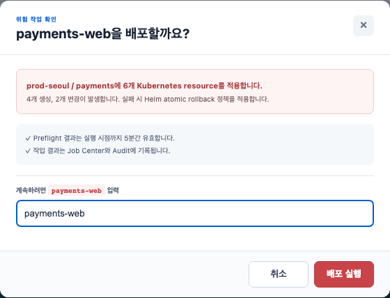

배포 Confirm 규칙:

1. 대상 Cluster/Namespace/Release를 다시 표시한다.
2. Create/Update/Delete 수와 경고를 요약한다.
3. 사용자가 Release 이름 `payments-web`을 정확히 입력해야 버튼이 활성화된다.
4. Confirm 시점에 plan expiry와 권한을 서버에서 재검사한다.
5. 요청은 idempotency key로 한 번만 수락하고 Job Center에 등록한다.
6. 완료 Modal은 성공/실패/부분 실패와 다음 안전 행동을 제공한다.

### 15.8 Deployed Applications

| Control | Overlay/상태 | Confirm 이후 |
| --- | --- | --- |
| `Application 배포` | 시작 chooser Modal: `Chart Library에서 선택`(기본·권장), `새 Chart 검색`, `URL 또는 .tgz 가져오기` | Library는 Chart/version 선택, 검색은 Discover, 직접 가져오기는 검사 Modal로 분기 |
| Cluster/Status filter | release table filter | URL query 보존 |
| Application row | 우측 health/endpoint/history 교체 | 별도 Confirm 없음 |
| `…` | 상세/Audit/Uninstall 계획 action menu | Uninstall은 별도 exact confirmation 필요 |
| `Rollback` | target revision과 영향이 표시된 위험 Modal | Release 이름 exact match 후 rollback Job |
| `Upgrade` | 현재 Chart/Values를 고정해 Values Studio 이동 | Preview를 다시 통과해야 실행 가능 |
| `상세 보기` | Application Detail 이동 | Workload/Endpoint/ownership 확인 |

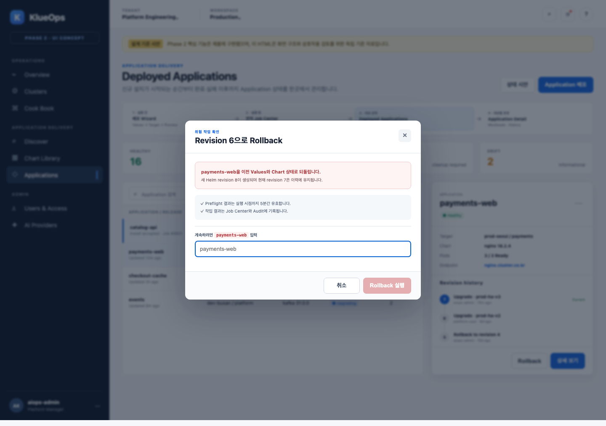

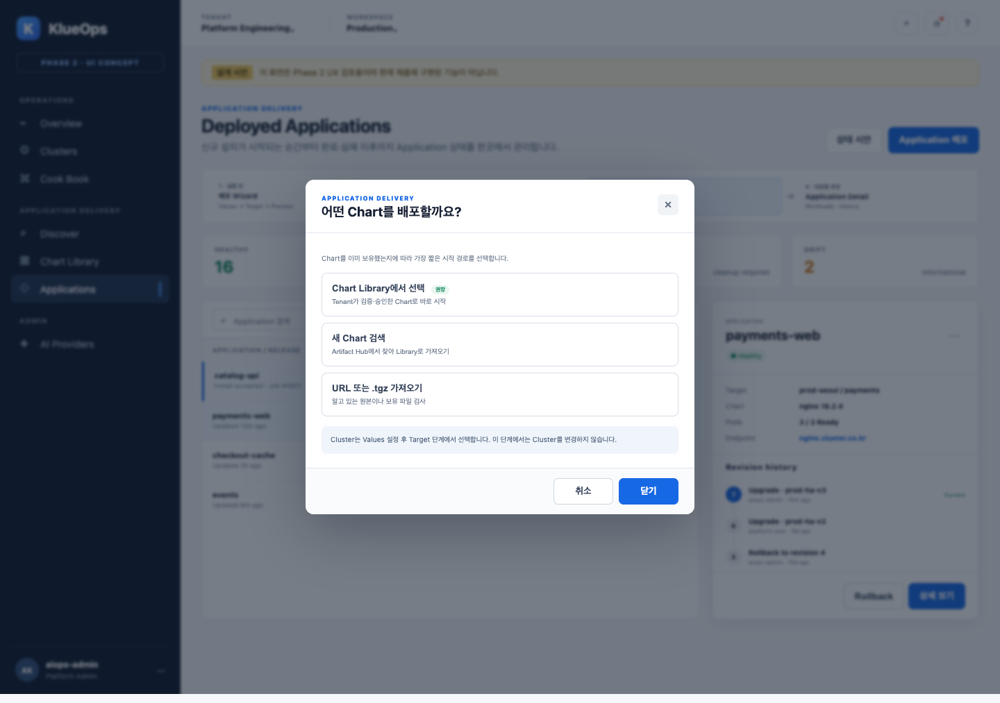

Uninstall은 Pod뿐 아니라 PVC, hook과 external resource 보존 여부를 계획 화면에서 먼저 보여주고 `release/namespace` exact phrase를 요구한다. 목록의 action menu에서 즉시 삭제하지 않는다.

배포 시작 chooser 원칙:

1. 사용자가 이미 보유한 승인 Chart를 가장 짧은 기본 경로로 둔다.
2. Library가 비어 있으면 Empty State에서 검색과 직접 가져오기를 같은 맥락으로 안내한다.
3. Discover는 Chart가 없는 사용자를 위한 검색 기능이며 배포 버튼의 암묵적 목적지가 아니다.
4. chooser에는 “Cluster는 Target 단계에서 선택하며 지금은 Cluster를 변경하지 않는다”는 설명을 표시한다.

### 15.9 Application Detail

| Control | Overlay/상태 | Confirm 이후 |
| --- | --- | --- |
| 상세 tab | Overview/Workloads/Network/Configuration/History/Resources 변경 | URL tab query 보존 |
| Endpoint URL | 새 tab으로 실제 endpoint 열기 | 접근 실패 시 진단 안내 |
| `Kubernetes Console` | 소유 Deployment/Pod Console 이동 | Tenant scope 유지 |
| `접근 설정 변경` | 기존 Exposure를 채워 Target/Exposure 화면 이동 | 새 Preview/Confirm 필요 |
| `AI Analysis` | Application evidence 수집 Job | section별 부분 실패와 fallback 표시 |
| `Uninstall 계획` | Helm/companion/PVC/DNS/TLS/Namespace/Library 범위 Modal | Preview 후 `release/namespace` exact confirmation |

### 15.10 AI Provider Settings

| Control | Overlay/상태 | Confirm 이후 |
| --- | --- | --- |
| `Provider Profile` | Provider→Credential→Model→Tenant 4단계 Modal | synthetic prompt 연결 검사 후 저장 |
| `정책 보기` | 외부 전송 포함/제외 데이터와 Audit 정책 Modal | 읽음 확인 |
| Provider `설정` | 선택 Provider가 채워진 설정 Modal | credential 교체 또는 연결 검사 |
| `Models 관리` | 선택 Ollama Profile의 Local Models 화면 | 설치·검증·승인·삭제 보호 |
| Provider `…` | 연결 검사/편집/비활성/삭제 action menu | 사용 중 profile 삭제는 차단 |
| Routing profile/model selector | 허용된 profile과 9B 이하 local model selector | 미저장 상태 표시 |
| External Transfer switch | 데이터 반출 경고 및 정책 동의 Modal | Tenant/purpose별 명시 동의 후만 ON |
| `변경 저장` | 세 purpose의 before/after와 External 상태 검토 Modal | 새 요청부터 적용, 실행 중 Job 불변 |

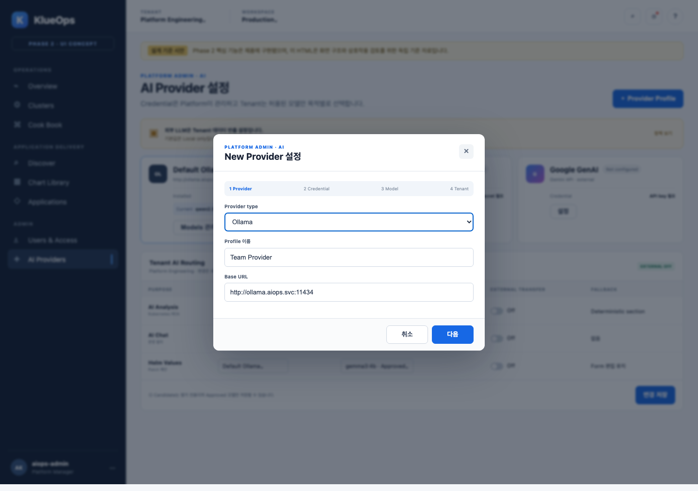

### 15.11 Local Models

| Control | Overlay/상태 | Confirm 이후 |
| --- | --- | --- |
| `Local Model 추가` | library model tag, parameter limit, size/volume 검토 Modal | Download Job 시작 |
| Approved/Candidate filter | model 상태 filter | URL query 보존 |
| Model `…` | capability/regression/Tenant 허용/삭제 가능 검사 menu | 사용 중 model 삭제 차단 |
| `AI Providers` | Provider와 Tenant routing 화면 복귀 | 선택 Ollama profile 유지 |

### 15.12 Users & Access

| Control | Overlay/상태 | Confirm 이후 |
| --- | --- | --- |
| Tenant selector | 접근 가능한 Tenant 목록, 역할과 membership 상태 표시 | access contract 재조회 후 메뉴·목록·Preview 원자적 교체 |
| User row | 역할, scope, source(Group/direct), 상태와 Access Preview Drawer | 관리 권한이 있으면 편집 action 노출 |
| `User 추가` | 관리형 Keycloak은 User 생성, 외부 OIDC는 pending email/subject 등록 모드 | `INVITED` membership 생성 및 초대/IdP 준비 안내 |
| `역할·Scope 편집` | before/after capability와 표시 메뉴 Preview | 다음 요청부터 access revision 갱신; 자기 권한 위험 변경 차단 |
| `접근 중지` | session, token, 진행 Job 영향과 복구 가능 여부 Preview | User suspend와 session revoke, 결과 Audit 기록 |
| `탈퇴 처리` | RoleBinding, credential, Job, ownership transfer와 IdP 범위 plan | exact username 입력 후 offboard; Audit actor snapshot 유지 |
| `OIDC Group Mapping` | issuer, group claim, Tenant, Role, Tenant/Workspace/Cluster/Namespace scope 입력 | claim sample·관계 검증 후 Mapping 저장 및 access revision 갱신 |
| Group Mapping `…` | 편집/비활성/삭제와 영향 사용자 Preview | 다음 요청부터 회수; Platform Manager Mapping은 별도 권한 검사 |
| `Tenant 기능` switch | 영향 메뉴·직접 route/API와 필수 기능 여부 Preview | Feature OFF/ON 적용; Role capability는 추가하지 않음 |

마지막 Platform Manager의 접근 중지·탈퇴·Role 회수는 Confirm 단계로 진입하지 않고 대체 관리자 지정 안내를 표시한다. 다른 Tenant Resource를 직접 URL로 연 경우 존재 여부를 숨기는 Not Found 화면을, Feature OFF와 capability 부족은 각각 다른 원인·관리자 문의 경로를 표시한다.

### 15.13 Modal 상태와 오류

| 상태 | 표시 원칙 |
| --- | --- |
| Opening | 첫 입력 field로 focus 이동, background scroll 차단 |
| Validation | field 바로 아래 원인과 해결 방법 표시, Confirm 비활성 |
| Submitting | Confirm spinner와 중복 클릭 차단, 취소는 request 접수 전만 허용 |
| Accepted | Modal을 Job progress로 전환하고 job ID 표시 |
| Failed before accept | 입력 유지, masking된 오류와 재시도 제공 |
| Failed after accept | Job Center에서 실패 단계, rollback/cleanup과 Audit link 제공 |
| Expired plan | 실행 차단, Preview 재생성만 제공 |
| Permission changed | 실행 차단, 필요한 권한과 Cluster 관리자 문의 안내 |

### 15.14 구현 필수 상태 Matrix

| 상태 | 필수 화면 행동 |
| --- | --- |
| Loading | 기존 결과를 갑자기 지우지 않고 skeleton/progress와 수행 중인 작업을 설명 |
| Empty Library | “아직 Chart가 없음”과 Discover/직접 가져오기 CTA 제공 |
| No results | 검색어/필터 유지, 필터 초기화와 대체 검색 안내 |
| Permission denied/changed | 실행 차단, 필요한 scope와 관리자 문의 경로 제공 |
| Provider/Repository failure | 입력 유지, masking된 원인, 재시도/설정 수정 제공 |
| Expired plan | 위험 실행 차단, Preview 재생성 CTA만 제공 |
| Deploy failure/rollback | 실패 단계, atomic rollback, cleanup 잔여를 각각 표시 |
| DNS manual action | 필요한 record type/name/value와 재검사 제공 |
| Failed cleanup | 소유권별 남은 resource와 안전한 재시도/Console link 제공 |
| Partial collection | 초보자용 제한 설명을 confidence 가까이에 표시하고 source 상세는 펼침 영역 제공 |

HTML의 `상태 시안`은 이 Matrix의 대표 상태를 한 화면에서 비교하는 구현 계약이며, 각 실제 route에도 같은 공통 component로 적용한다.

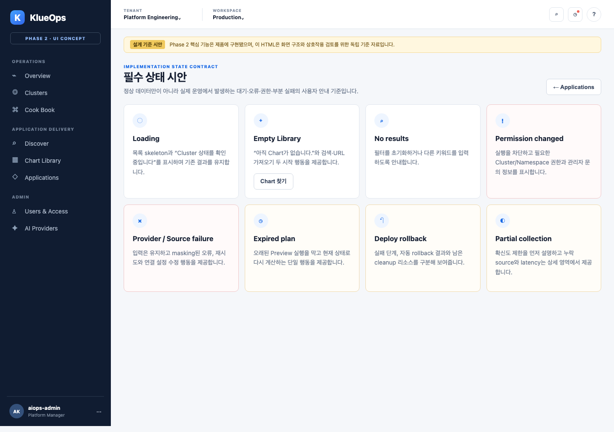

## 16. Responsive

- 1280px 이상: sidebar + main + detail/assistant 3-column
- 900~1279px: sidebar + main, detail drawer overlay
- 899px 이하: sidebar 접힘, step별 단일 column
- Values Editor와 Preview table은 horizontal scroll보다 field/card 재배치를 우선한다.
- 위험 confirmation은 mobile에서도 viewport 아래로 숨지 않게 sticky action bar를 사용한다.

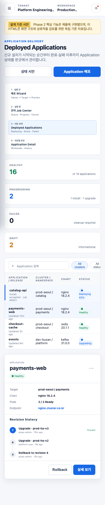

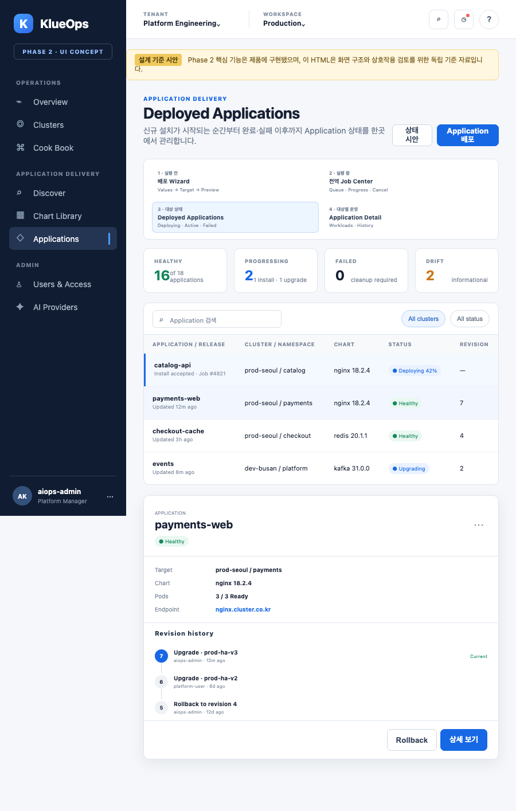

## 17. 접근성

- status를 색만으로 구분하지 않고 icon/text를 함께 제공한다.
- tab, drawer, modal과 stepper에 keyboard focus 순서와 ARIA 상태를 제공한다.
- AI streaming과 Job progress는 과도한 live announcement를 피하고 완료/실패만 polite region으로 알린다.
- YAML validation은 line/column과 해결 방법을 text로 제공한다.
- 위험 action은 icon-only button으로 제공하지 않는다.
- Modal은 `role=dialog`, `aria-modal`, label을 제공하며 focus trap과 trigger focus 복원을 구현한다.
- exact confirmation은 paste를 막지 않으며 대소문자/공백 불일치를 field 오류 text로 설명한다.

## 18. Frontend 구현 경계

- route: `/applications/discover`, `/applications/library`, `/applications/library/sources`, `/applications`
- Values Studio: `/applications/charts/:chartId/versions/:versionId/values/:profileId`
- Target/Exposure: `/applications/deployment-plans/:planId/target`
- Preview: `/applications/deployment-plans/:planId`
- Application Detail: `/applications/:applicationId?tab=overview`
- AI Settings: `/settings/ai-providers`
- Ollama Models: `/settings/ai-providers/:profileId/models`
- catalog/import/deploy API client는 `frontend/src/api`에 둔다.
- long-running job은 `jobCenter` store에 등록한다.
- cross-screen filter는 전용 Pinia store보다 URL query를 우선한다.
- page component는 조합만 담당하고 catalog card, Values editor, AI suggestion, policy result와 release history를 component로 분리한다.
- CSS는 `frontend/src/styles/components/application-delivery.css` 한 ownership 파일에서 시작한다.
